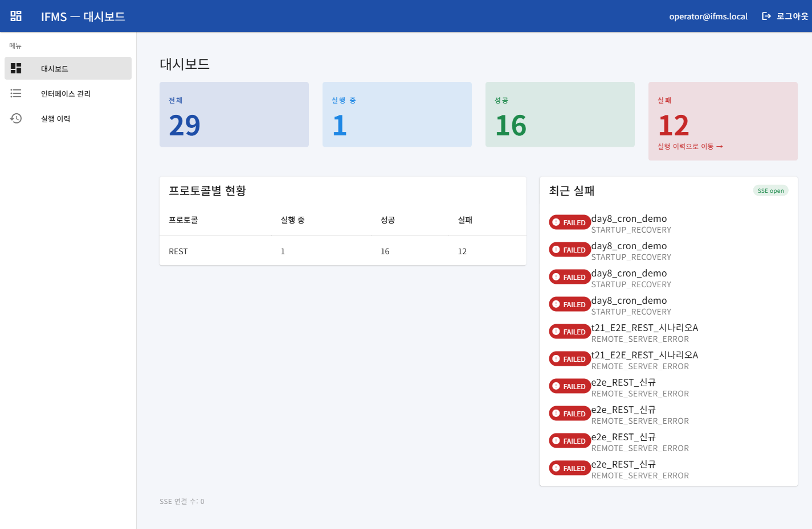
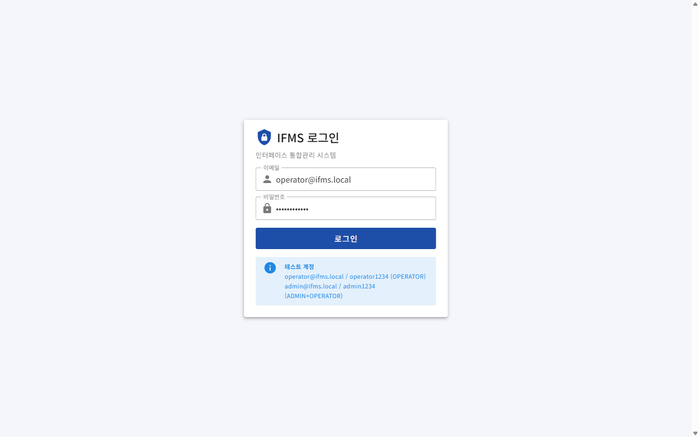
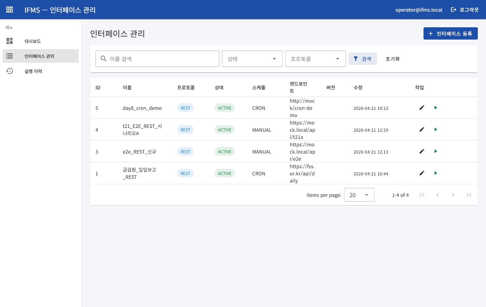
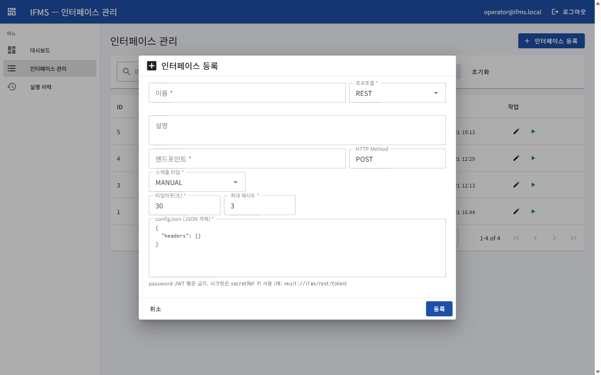
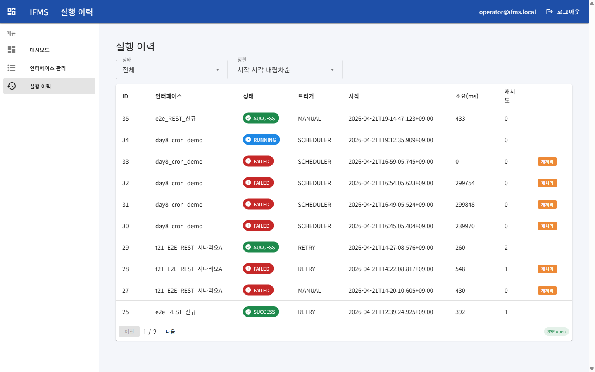
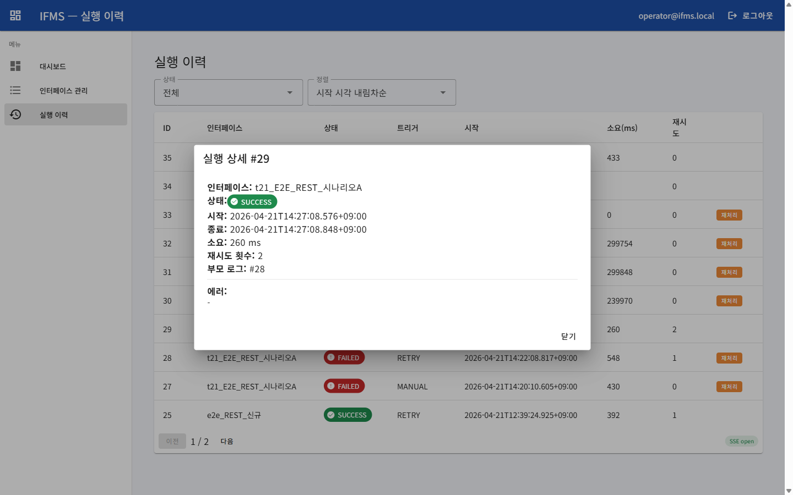
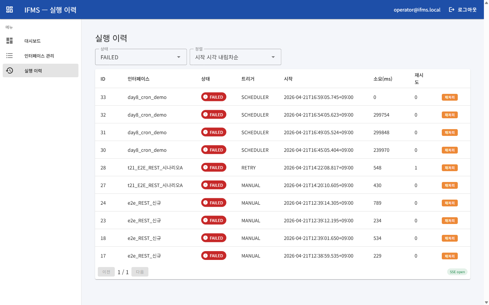
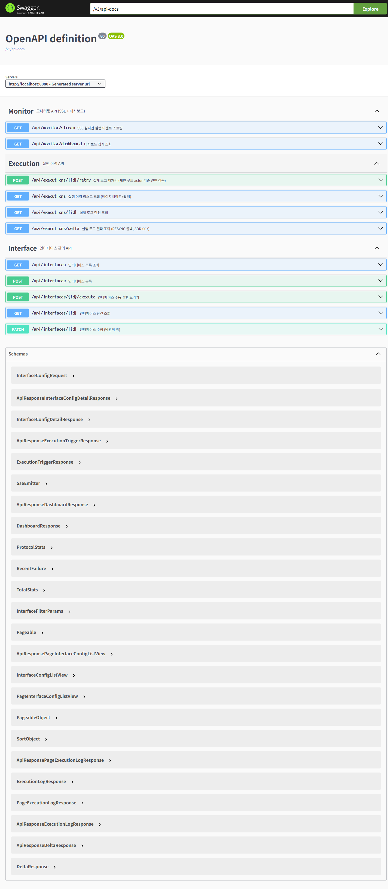
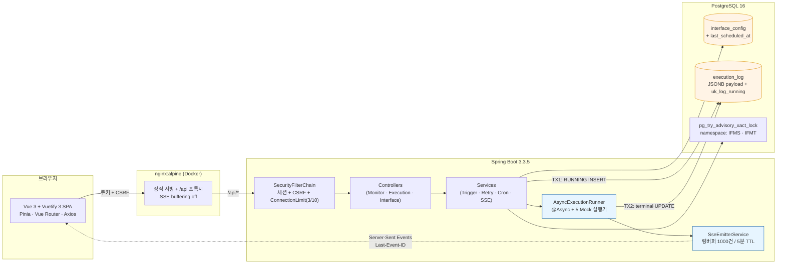

<div align="center">

# IFMS — 보험사 인터페이스 통합관리 시스템

**Interface Management System** · 노아에이티에스 2026년 공채 15기 입사 과제

REST·SOAP·MQ·배치·SFTP 5종 이기종 인터페이스를 **단일 화면에서 등록·실행·모니터링·재처리**하는 중앙 관리 플랫폼



`Java 17` · `Spring Boot 3.3.5` · `Vue 3 + Vuetify 3` · `PostgreSQL 16` · `Server-Sent Events` · `Docker Compose` · **자동 테스트 45 PASS**

</div>

---

## 목차

1. [30초 요약](#1-30초-요약)
2. [실행 방법](#2-실행-방법)
3. [시연 스토리보드](#3-시연-스토리보드)
4. [시스템 아키텍처](#4-시스템-아키텍처)
5. [핵심 설계 판단](#5-핵심-설계-판단)
6. [테스트·빌드 상태](#6-테스트빌드-상태)
7. [문서·API 인덱스](#7-문서api-인덱스)
8. [개발 과정](#8-개발-과정)
9. [의도적 제외 및 운영 이관](#9-의도적-제외-및-운영-이관)

---

## 1. 30초 요약

### 해결하는 문제

보험사 IT 운영팀은 "오늘 몇 건 돌았고 몇 건 실패했나"라는 단순한 질문에 답하기 위해 **배치 콘솔·DBA 쿼리·SSH 로그 grep·MQ 관리 콘솔** 3~4개 도구를 경유한다. 실패 건 재처리는 SSH에서 수동 curl, 감사 추적은 파편화, 일일 보고는 엑셀 30분.

### 본 프로토타입이 제공하는 것

| 운영 동작 | 종전 | IFMS |
|---|---|---|
| 인터페이스 현황 파악 | 3~4개 도구 경유 | **단일 대시보드** (4 카드 + 프로토콜별 표 + 최근 실패) |
| 실시간 실행 상태 | DBA 쿼리 / 로그 grep | **SSE 실시간 스트림** (Last-Event-ID 재동기화) |
| 실패 건 재처리 | SSH + 수동 curl | **"재처리" 버튼 1클릭** + 부모-자식 체인 감사 추적 |
| 정기 자동 실행 | 시스템별 cron | **scheduleType=CRON** 인터페이스 (1분 폴링, advisory lock 방어) |
| 감사 로그 | 시스템마다 상이 | **ExecutionLog 통합 저장** (actor · IP · payload · duration · 체인) |

---

## 2. 실행 방법

### 옵션 A — 전체 Docker

```bash
cp .env.example .env
docker compose --profile full up -d --build
```

- 첫 빌드 **5~8분** (Gradle 의존성 다운로드 포함)
- 기동 완료: `docker compose --profile full ps` → postgres·backend·frontend 3개 모두 `healthy`
- 접속: <http://localhost:8090> → `operator@ifms.local` / `operator1234`
- Swagger UI: <http://localhost:8080/swagger-ui/index.html>

3 컨테이너 healthy 상태 예시 ([전체 출력](docs/screenshots/Step8-docker-compose-ps.txt)):

```text
NAME            IMAGE                 STATUS                    PORTS
ifms-backend    ifms-backend:local    Up (healthy)              127.0.0.1:8080->8080/tcp
ifms-frontend   ifms-frontend:local   Up                        127.0.0.1:8090->80/tcp
ifms-postgres   postgres:16-alpine    Up (healthy)              127.0.0.1:5432->5432/tcp
```

### 옵션 B — 호스트 개발

```bash
# 1) PostgreSQL만 Docker
cp .env.example .env
docker compose up -d

# 2) 백엔드 (8080)
cd backend && ./gradlew bootRun

# 3) 프런트 (Vite dev, 5173, 백엔드 프록시)
cd frontend && npm install && npm run dev
```

접속: <http://localhost:5173> (hot reload 활성)

### 환경 요구

| 옵션 A | 옵션 B |
|---|---|
| Docker Desktop / Engine 만 | Docker + JDK 17+ + Node.js 20+ |
| 포트: 5432·8080·8090 | 포트: 5432·8080·5173 |

### 테스트 계정

```
operator@ifms.local / operator1234   (OPERATOR)
admin@ifms.local    / admin1234      (ADMIN + OPERATOR)
```

---

## 3. 시연 스토리보드

### 3.1 로그인 → 대시보드

세션 기반 인증 + CSRF (Cookie + XSRF-TOKEN 헤더). 테스트 계정이 폼에 pre-fill 되어 있다.

| 로그인 | 대시보드 (히어로) |
|---|---|
|  |  |

대시보드 구성:
- **4 카드** — 전체 / 실행중 / 성공 / 실패. 실패 카드 클릭 → `/history?status=FAILED` 드릴다운 (Step 7 M5)
- **프로토콜별 현황 표** — REST / SOAP / MQ / BATCH / SFTP 각각 실행중·성공·실패 카운트
- **최근 실패 N건** — 인터페이스명 + 에러 코드 (위 화면에 `STARTUP_RECOVERY`, `REMOTE_SERVER_ERROR` 표시)
- **우상단 `SSE open`** 녹색 배지 — 실시간 이벤트 스트림 연결 상태

### 3.2 인터페이스 등록 · 수동 실행 · SSE 실시간 반영

| 인터페이스 목록 | 등록 다이얼로그 |
|---|---|
|  |  |

- **목록**: 이름 검색 · 상태/프로토콜 필터 · 페이지네이션 · 수정(🖊) / 실행(▶) 버튼
- **등록**: REST/SOAP/MQ/BATCH/SFTP 5종 선택 · scheduleType=CRON 선택 시 cronExpression 필드 조건부 노출 · JSON 검증 · **시크릿 평문 금지** (`secretRef: vault://...` 형식 강제)

> ⚠ 위 폼 하단 안내: **"password·JWT 평문 금지. 시크릿은 `secretRef` 키 사용 (예: `vault://ifms/rest/token`)"**. `ConfigJsonValidator` (ADR-006) 가 Service 레이어에서 검사해 API 400 응답.

### 3.3 실행 이력 — MANUAL / SCHEDULER / RETRY 3종 트리거 혼재

수동 실행 버튼을 누르면 즉시 트리거 → TX1에서 `ExecutionLog` RUNNING 기록 → `@Async` 가 Mock 실행기 호출 → SSE 로 대시보드·실행 이력 화면에 **in-place 상태 전이 이벤트** 방송.



한 화면에서 확인할 수 있는 것:
- **ID 35 MANUAL SUCCESS** 433ms — 방금 UI에서 실행 버튼 누른 결과 (SSE 로 즉시 반영)
- **ID 34 SCHEDULER RUNNING** — CRON 인터페이스가 자동 발화한 최신 실행 (Step 8)
- **ID 30~33 SCHEDULER FAILED** — 과거 CRON 자동 실행들. 각각 "재처리" 버튼 제공
- **ID 29 RETRY SUCCESS (재시도 2회)** — 재처리 체인이 성공으로 수렴한 끝점
- **ID 28 RETRY FAILED → ID 29** 재처리 → 성공. 같은 `interfaceConfigId` 에 대해 `parent_log_id` 로 연결 (ADR-005)
- **우하단 `SSE open` 녹색** — 스트림 연결 유지

### 3.4 실행 상세 — 재처리 체인 감사 추적

행 클릭 시 상세 다이얼로그. 재처리 건은 **`부모 로그: #28`** 처럼 체인 링크 표시.



- `시작` / `종료` offset-aware ISO-8601 (api-spec §1.4)
- `재시도 횟수: 2` — 원본 #27 → 재처리 #28 → 재처리 #29 까지 2회
- `부모 로그: #28` — 직전 실패 로그 ID. 원본 추적 가능

### 3.5 드릴다운 — 실패만 보기

대시보드 "실패" 카드 클릭 또는 상태 필터에서 FAILED 선택.



- URL 쿼리 `?status=FAILED` 로 필터 상태 보존 (뒤로가기/북마크 호환, Step 7 M5)
- 모든 FAILED 행에 **"재처리"** 버튼 노출 — `ADR-005` Q1 "max_retry_snapshot 정책"에 의해 한계 초과 시만 비활성

### 3.6 Swagger UI — 11 엔드포인트 전체

`/swagger-ui/index.html` 에서 모든 API try-it-out 가능.



3 태그 / 11 엔드포인트:
- **Monitor** — `GET /api/monitor/stream` (SSE), `GET /api/monitor/dashboard`
- **Execution** — `POST /api/executions/{id}/retry`, `GET /api/executions`, `GET /api/executions/{id}`, `GET /api/executions/delta` (ADR-007)
- **Interface** — `GET/POST/PATCH /api/interfaces`, `POST /api/interfaces/{id}/execute`

---

## 4. 시스템 아키텍처



### 핵심 흐름 3가지

1. **수동 실행**: `POST /api/interfaces/{id}/execute` → `ExecutionTriggerService` 가 advisory lock 획득 → TX1에서 RUNNING 로그 INSERT → 커밋 직후 SSE `started` emit → `@Async` 로 Mock 실행기 호출 → TX2에서 SUCCESS/FAILED 종결 → SSE `finished` emit.

2. **CRON 자동 실행 (Step 8)**: `InterfaceCronScheduler` 가 1분 주기 폴링 → ACTIVE+CRON 인터페이스 조회 → `CronExpression.next(lastScheduledAt) <= now` 인 것만 `ExecutionTriggerService.trigger(SCHEDULER, ...)` 호출. 기존 advisory lock + `uk_log_running` 보호막을 그대로 재사용.

3. **재처리**: `POST /api/executions/{logId}/retry` → `RetryService` + `RetryGuard` 가 root-actor / max_retry / active-chain / leaf 4가지 정책 검증 (ADR-005) → 성공 시 새 `RETRY` 로그에 `parent_log_id` = logId 로 체인 연결 → TX1/TX2 흐름 동일하게 재진입.

---

## 5. 핵심 설계 판단

본 프로토타입은 단순히 CRUD를 쌓지 않고, 금융 SI 운영에서 예상되는 동시성·감사·실패 모드를 **Architecture Decision Records** 7건으로 명문화했다.

### ADR-001 · `ExecutionLog` 트랜잭션 분리 (TX1 + TX2)

[`docs/adr/ADR-001-execution-log-transaction.md`](docs/adr/ADR-001-execution-log-transaction.md)

- **문제**: 실행 트리거에서 Mock 호출까지 단일 트랜잭션으로 묶으면 커넥션 점유 시간이 외부 응답 시간(수 초 ~ 수십 초)에 종속.
- **결정**: TX1(RUNNING INSERT, 수 ms)과 TX2(terminal UPDATE) 분리. SSE emit은 `afterCommit`에서만 (롤백 시 유령 이벤트 방지).
- **제약**: TX1 커밋 후 `@Async` 트리거까지 프로세스 크래시 시 고아 RUNNING 가능 → `OrphanRunningWatchdog` 가 5분 주기로 `timeout_seconds + 60s` 초과 건 회수.

### ADR-004 · 동시 실행 중복 방지 (advisory lock + partial UNIQUE)

[`docs/adr/ADR-004-concurrent-execution-prevention.md`](docs/adr/ADR-004-concurrent-execution-prevention.md)

- **2중 방어선**: (a) `pg_try_advisory_xact_lock(IFMS, interface_id)` 로 동시 INSERT 경합 대부분 차단. (b) `uk_log_running` partial UNIQUE (`status='RUNNING'`) 가 정상 경로 최종 방어.
- **Step 8 파급**: CRON 스케줄러와 수동 실행이 동시에 같은 인터페이스를 트리거해도 **정확히 1건만 성공** (ConflictException 흡수). E2E 로 실측 확인.

### ADR-005 · 재처리 정책 (root actor + max_retry_snapshot)

[`docs/adr/ADR-005-retry-policy.md`](docs/adr/ADR-005-retry-policy.md)

- `max_retry_snapshot`: 원본 실행 시점의 `maxRetryCount`를 로그에 고정 저장. 이후 정책 변경해도 체인 중간에 규칙이 바뀌지 않음.
- `root_actor_id`: 체인 루트의 actor만 재처리 가능. 이메일 A가 시작한 체인을 이메일 B가 이어서 재처리하는 감사 구멍 차단.
- SYSTEM / ANONYMOUS / truncated / inactive / not_leaf 5개 에러 케이스 전부 `RetryGuardSnapshotPolicyTest` (8 케이스) 로 단위 검증.

### ADR-006 · `ConfigJsonValidator` 호출 지점

[`docs/adr/ADR-006-config-json-validator-call-site.md`](docs/adr/ADR-006-config-json-validator-call-site.md)

- **결정**: EntityListener 대신 **Service 레이어에서 create/update 시 호출**. Hibernate 엔티티 리스너의 부분 적용 리스크 회피.
- **강제**: `ArchitectureTest` (ArchUnit 3룰) — Controller에서 Repository 직접 주입 금지 / EntityManager.merge 금지 / `@Modifying` 한정.

### ADR-007 · SSE 재동기화 + 세션 경계 프로토콜

[`docs/adr/ADR-007-sse-resync-session-boundary.md`](docs/adr/ADR-007-sse-resync-session-boundary.md)

- **Last-Event-ID** + **`clientId` 재할당 + grace 2s**: 네트워크 끊김 → EventSource 자동 재연결 시 서버 링버퍼(1000건·5분 TTL)에서 누락 구간 재생. 동일 clientId가 두 세션에 동시 구독하는 TOCTOU race 는 `SseSubscribeRaceTest` @RepeatedTest(20) 로 재현 확인 (현재 M4, 단일 인스턴스라 실 발생 확률 낮음).
- **`/api/executions/delta?since=` 폴백**: 링버퍼 밖으로 나간 이벤트는 delta API로 회수.

### Step 8 추가 판단 (본 README 제출용)

- **CRON 자동 실행 실구현** — planning §3에 명시됐던 필수 기능 완성. `catch-up 안 함`을 명시적 설계로 채택 (재기동 시 `last_scheduled_at=NULL` → 첫 tick을 기준점으로만 기록).
- **JWT 전환 거부** — 4-에이전트 회의(Security/DBA/DevilsAdvocate) 전원 반대 수렴. 세션+CSRF+HttpOnly 쿠키가 금융권 표준에 더 가깝고, 1일 내 완전 전환 불가 + 기존 E2E 회귀 리스크. 근거는 `docs/superpowers/specs/2026-04-22-Step8-submission-polish-design.md` §1.
- **@Transactional self-invocation 회귀** — Task 3 단위 테스트 5건 + 리뷰 2종 전부 통과했으나, 실 Docker E2E에서 `sweep() → this.tick()` 자기호출이 프록시 우회해 `@Transactional` 미적용인 것을 발견. `configRepository.save()` 명시 호출 + 회귀 테스트 4건 추가로 fix. 상세는 [`Step8-SUMMARY §5`](docs/Step8-SUMMARY.md).

---

## 6. 테스트·빌드 상태

### 자동 테스트 (45 / 0 fail / 5 skip)

```bash
cd backend
./gradlew test                                              # 45 케이스 (~25s)
./gradlew test --tests "*InterfaceCronSchedulerTest*"       # Step 8 CRON 5 케이스
RUN_BENCH=1 ./gradlew test --tests "MaskingRuleBenchTest"   # 마스킹 p95 < 50ms 벤치
```

| 범주 | 케이스 | 비고 |
|---|---:|---|
| ArchUnit 룰 | 3 | Repository 주입 범위 · EntityManager.merge 금지 · @Modifying 한정 |
| Step 6 SSE·delta·cursor·rate | 17 | `DeltaServiceTest` · `CursorTest` · `RateLimiterTest` · `SseEmitterServiceTest` |
| Step 7 RetryGuard 정책 | 8 | ADR-005 Q1/Q2 × SYSTEM/ANONYMOUS/truncated/inactive/not_leaf/all_pass |
| Step 7 SnapshotParity / ApiResponse / Masking bench | 4 | Detail↔Snapshot 필드 정합 · ALWAYS 직렬화 · p95 벤치 |
| Step 7 SSE subscribe race (`@RepeatedTest(20)`) | 1 | M4 재현용. 현재 @Disabled (fix 후 활성) |
| **Step 8 InterfaceCronScheduler** | **5** | 발화 / 미발화 / 최초기동 / 경합흡수 / 잘못된cron |
| Skipped (Testcontainers 5) | 5 | Docker Desktop 29 + Testcontainers 1.20 호환 이슈 — 코드는 보존 |

### 프런트엔드

```bash
cd frontend
npm run build   # vue-tsc 타입체크 + vite 빌드 → dist/
```

### 이미지·런타임

| 컴포넌트 | 베이스 | 크기 | 용도 |
|---|---|---|---|
| `ifms-backend:local` | `eclipse-temurin:17-jre-alpine` | 365 MB | Spring Boot fat jar + nc + bash + Asia/Seoul TZ |
| `ifms-frontend:local` | `nginx:alpine` | 28.5 MB | Vite build dist + nginx.conf (SSE 호환: `proxy_buffering off`, `chunked_transfer_encoding on`) |

---

## 7. 문서·API 인덱스

### 설계 원본 (docs/)

| 문서 | 목적 |
|---|---|
| [planning.md](docs/planning.md) | 기획서 — 배경·페르소나·As-Is/To-Be·MVP 범위 |
| [erd.md](docs/erd.md) | ERD 정본 — 엔티티·인덱스·CHECK 제약·JSONB 규약 |
| [api-spec.md](docs/api-spec.md) | API 명세 v0.8 — 11 엔드포인트 + ErrorCode 21종 + ApiResponse + DefensiveMaskingFilter |

### ADR (docs/adr/)

- [ADR-001 · ExecutionLog 트랜잭션 범위](docs/adr/ADR-001-execution-log-transaction.md)
- [ADR-004 · 동시 실행 중복 방지](docs/adr/ADR-004-concurrent-execution-prevention.md)
- [ADR-005 · 재처리 정책](docs/adr/ADR-005-retry-policy.md)
- [ADR-006 · ConfigJsonValidator 호출 지점](docs/adr/ADR-006-config-json-validator-call-site.md)
- [ADR-007 · SSE 재동기화 + 세션 경계](docs/adr/ADR-007-sse-resync-session-boundary.md)
- (ADR-002·003 은 본문 편입 — `planning §5.4` SSE / `erd §10` JSONB)

### 라이브 API

- Swagger UI: <http://localhost:8080/swagger-ui/index.html>
- OpenAPI JSON: <http://localhost:8080/v3/api-docs>

### Step-by-Step 요약

| Step | 핵심 산출 | 문서 |
|---|---|---|
| Step 2 | 도메인 모델 · JPA · 인터페이스 CRUD API | [Step2-SUMMARY](docs/STEP2-SUMMARY.md) |
| Step 3 | 실행 트리거 · Mock 실행기 5종 · RetryService · Watchdog | [Step3-SUMMARY](docs/STEP3-SUMMARY.md) |
| Step 4 | Spring Security · SSE 기반 · 대시보드 집계 · ConnectionLimit | [Step4-SUMMARY](docs/STEP4-SUMMARY.md) |
| Step 5 | Vue 3 scaffold · InterfaceList/Form · 낙관적 락 충돌 처리 | [Step5-SUMMARY](docs/STEP5-SUMMARY.md) |
| Step 6 | Dashboard · ExecutionHistory · delta API · ADR-007 | [Step6-SUMMARY](docs/STEP6-SUMMARY.md) |
| Step 7 | M1~M9 부채 청산 · 자동 테스트 12건 + race · 문서 정합 | [Step7-SUMMARY](docs/STEP7-SUMMARY.md) |
| **Step 8** | **CRON 자동 실행 + Docker 한 줄 기동 + E2E Playwright 자동화** | **[Step8-SUMMARY](docs/STEP8-SUMMARY.md)** |

### 백로그·이월

[backlog.md](docs/backlog.md) — 운영 이관 항목 사유 명문화

---

## 8. 개발 과정

1주일 단일 개발자. 매일 **다중 에이전트 기술 회의**로 설계 결정을 남기고 ADR 로 기록.

```
Step 1  기획·ERD·API 명세·프로젝트 초기화
Step 2  도메인·JPA·인터페이스 CRUD              (ADR-001, ADR-004, ADR-006)
Step 3  실행 트리거·Mock 실행기·재처리·Watchdog
Step 4  Security·SSE·대시보드·ArchUnit·traceId
Step 5  Vue 프런트 scaffold·목록·등록·수동 실행
Step 6  이력·대시보드·SSE 연동·delta             (ADR-007)
Step 7  부채 청산·통합/단위/벤치 테스트·문서 정합
Step 8  CRON 자동 실행·Docker 한 줄 기동·E2E 자동화  ← 본 README 제출 시점
```

### 방법론

- **4-에이전트 회의** (Architect / Security / DBA / DevilsAdvocate) — 결정 시점마다 ADR 또는 spec 본문 편입
- **subagent-driven development** (Step 8) — 9 Task 분할 후 각 Task마다 implementer + spec-review + code-quality-review 3 subagent 파이프라인 적용. Important/Critical 이슈 9건 발견→fix 루프
- **Playwright MCP E2E 자동화** (Step 8) — 수동 검증을 브라우저 자동화로 치환. 본 README 의 8개 스크린샷 모두 자동 촬영

---

## 9. 의도적 제외 및 운영 이관

본 프로토타입은 1주일 일정으로 다음 항목을 **의도적으로 제외**하고 설계만 문서화하거나 backlog에 이관했다. 상세 사유는 [`backlog.md`](docs/backlog.md) "운영 전환" 섹션.

| 제외 항목 | 현재 상태 | 이관 트리거 |
|---|---|---|
| JWT 인증 / SSO | 세션+CSRF+HttpOnly 쿠키. Step 8 회의에서 JWT 전환 거부 수렴 | Role 분리와 함께 재검토 |
| 실제 SOAP/MQ/SFTP 연동 | 5종 Mock 실행기 (`Thread.sleep + 랜덤 성공/실패`) | `MockExecutor` → `RealExecutor` 인터페이스 이미 준비 |
| Role 분리 (ADMIN/OPERATOR/AUDITOR) | 단일 OPERATOR. `@PreAuthorize` 초안만 | 운영 전환 시 일괄 |
| 분산 SSE (Redis Pub/Sub) | 단일 인스턴스 전제. 링버퍼 in-memory | 다중 인스턴스 전환 |
| Flyway 마이그레이션 | `ddl-auto=validate` + `schema.sql` 조합 | 컬럼 삭제/리네임 발생 시 |
| HMAC cursor 서명 (DeltaCursor) | 평문 base64. M2 로 기록 | 공개 API 노출 시 |
| rate limit 분산화 | in-memory Bucket. M3 | Redis/Bucket4j 도입 시 |
| OFFSET → Keyset 페이지네이션 | 데이터 1만 건 이하 전제 | 100만 건 초과 시 |
| Testcontainers 통합 테스트 5종 | Docker Desktop 29 호환 이슈로 skip. 코드·Seeder 보존 | TC 1.21+ 또는 Docker downgrade |
| 대시보드 차트 (프로토콜별 성공률) | 카드 + 표. sparkline 미적용 | 시각화 요구 구체화 시 |
| 성능 테스트 리포트 (K6/JMeter) | `MaskingRuleBenchTest` p95 < 50ms 만 | 운영 SLA 목표치 확정 시 |

---

<div align="center">

**© 2026 · 노아에이티에스 2026년 공채 15기 입사 과제 제출물**

코드·문서 · Java 17 · Spring Boot 3.3.5 · PostgreSQL 16 · Vue 3 · Vuetify 3 · Docker

1주 (2026-04-15 ~ 2026-04-21) · 단일 개발자 · 45 자동 테스트 PASS

</div>
