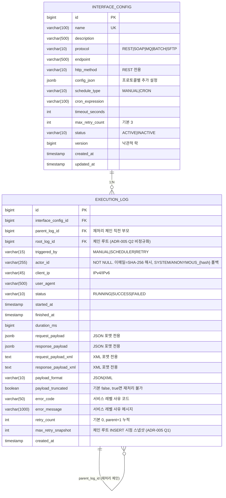

# ERD · 데이터베이스 설계

> **IFMS (보험사 금융 IT 인터페이스 통합관리시스템)**
> 대상 DBMS: PostgreSQL 16 (운영) / H2 2.x (테스트, `MODE=PostgreSQL`)
> 기획서: [planning.md](planning.md) · API 명세: [api-spec.md](api-spec.md)

---

## 1. 설계 원칙

| 원칙 | 적용 |
|---|---|
| PK 전략 | `BIGINT IDENTITY` (단조 증가, 8바이트, 범위 스캔 효율). UUID 기각 — 인덱스 비대화·정렬 불리 |
| 삭제 정책 | `InterfaceConfig`는 **소프트 딜리트**(`status=INACTIVE`). `ExecutionLog`는 **절대 하드 삭제 금지** (감사 요건), 보관 주기는 파티션 드롭으로 관리 |
| 감사 필드 | `BaseTimeEntity` (`created_at` / `updated_at`) 공통 상속. 실행 주체(`actor_id`·`client_ip`·`user_agent`)는 `execution_log`에 명시 |
| 연관관계 | 양방향 최소화. `InterfaceConfig` → `ExecutionLog`는 **단방향 N:1 (Child → Parent)** 만 JPA 매핑 |
| fetch | 기본 `LAZY`. 이력 목록 조회는 `@EntityGraph`로 N+1 방지 |
| 트랜잭션 | Service 계층 `@Transactional`만 허용. 클래스 레벨 `readOnly=true` 기본, 쓰기 메서드만 오버라이드 |
| payload | **JSONB** (집계·GIN 인덱스). SOAP XML은 `payload_format=XML`로 구분해 JSONB 문자열로 저장 |
| 크기 제한 | `request_payload` / `response_payload` **최대 64KB**. 초과 시 Service 레이어에서 truncate + `payload_truncated=true` |

---

## 2. ERD 전체 구조



**관계 설명**

- `interface_config` 1건 ↔ `execution_log` N건 (필수 외래키, ON DELETE RESTRICT)
- `execution_log` ↔ `execution_log` 자기참조: 원본 실행 → 재처리 실행 체인 (ON DELETE SET NULL)

---

## 3. 테이블 정의

### 3.1 `interface_config` — 인터페이스 정의

```sql
CREATE TABLE interface_config (
    id                BIGSERIAL     PRIMARY KEY,
    name              VARCHAR(100)  NOT NULL,
    description       VARCHAR(500),
    protocol          VARCHAR(10)   NOT NULL,
    endpoint          VARCHAR(500)  NOT NULL,
    http_method       VARCHAR(10),
    config_json       JSONB         NOT NULL DEFAULT '{}'::jsonb,
    schedule_type     VARCHAR(10)   NOT NULL DEFAULT 'MANUAL',
    cron_expression   VARCHAR(100),
    timeout_seconds   INT           NOT NULL DEFAULT 30,
    max_retry_count   INT           NOT NULL DEFAULT 3,
    status            VARCHAR(10)   NOT NULL DEFAULT 'ACTIVE',
    version           BIGINT        NOT NULL DEFAULT 0,
    created_at        TIMESTAMP     NOT NULL DEFAULT CURRENT_TIMESTAMP,
    updated_at        TIMESTAMP     NOT NULL DEFAULT CURRENT_TIMESTAMP,

    CONSTRAINT uk_ifc_name              UNIQUE (name),
    CONSTRAINT ck_ifc_protocol          CHECK (protocol IN ('REST','SOAP','MQ','BATCH','SFTP')),
    CONSTRAINT ck_ifc_status            CHECK (status IN ('ACTIVE','INACTIVE')),
    CONSTRAINT ck_ifc_schedule_type     CHECK (schedule_type IN ('MANUAL','CRON')),
    CONSTRAINT ck_ifc_timeout           CHECK (timeout_seconds BETWEEN 1 AND 600),
    CONSTRAINT ck_ifc_max_retry         CHECK (max_retry_count BETWEEN 0 AND 10),
    CONSTRAINT ck_ifc_http_method       CHECK (
        protocol <> 'REST'
        OR http_method IN ('GET','POST','PUT','PATCH','DELETE')
    ),
    CONSTRAINT ck_ifc_cron_required     CHECK (
        schedule_type <> 'CRON' OR cron_expression IS NOT NULL
    )
);

COMMENT ON TABLE  interface_config               IS '외부 연동 인터페이스 정의';
COMMENT ON COLUMN interface_config.config_json   IS 'REST headers, SFTP path, MQ queueName 등 프로토콜별 추가 설정';
COMMENT ON COLUMN interface_config.version       IS 'JPA @Version 낙관적 락';
```

**컬럼 설명**

| 컬럼 | 설명 |
|---|---|
| `name` | 운영자 가독성을 위한 논리명. 예: `금감원_일일보고_REST` |
| `protocol` | 5종 enum 제약 |
| `endpoint` | 프로토콜별 접속 대상. REST URL, SFTP host, MQ queue 등 |
| `http_method` | REST 한정. 나머지 프로토콜은 NULL 허용 (CHECK 제약으로 검증) |
| `config_json` | 프로토콜별 확장 설정. 스키마는 프로토콜에 따라 다름 (3.3 참조) |
| `cron_expression` | `schedule_type=CRON`일 때만 필수 |
| `timeout_seconds` | 1~600초. Mock 실행기는 현재 무시, 실연동 전환 시 사용 |
| `max_retry_count` | 재처리 최대 횟수. 초과 시 재처리 버튼 비활성화 |
| `status` | 소프트 딜리트용. `INACTIVE`는 목록에서 필터로 제외 가능 |
| `version` | `@Version` 낙관적 락. 동시 수정 충돌 방지 |

### 3.2 `execution_log` — 실행 이력

```sql
CREATE TABLE execution_log (
    id                   BIGSERIAL     PRIMARY KEY,
    interface_config_id  BIGINT        NOT NULL,
    parent_log_id        BIGINT,
    triggered_by         VARCHAR(15)   NOT NULL,
    actor_id             VARCHAR(255)  NOT NULL,
    client_ip            VARCHAR(45),
    user_agent           VARCHAR(500),
    status               VARCHAR(10)   NOT NULL,
    started_at           TIMESTAMP     NOT NULL,
    finished_at          TIMESTAMP,
    duration_ms          BIGINT,
    request_payload      JSONB,
    response_payload     JSONB,
    request_payload_xml  TEXT,
    response_payload_xml TEXT,
    payload_format       VARCHAR(10)   NOT NULL DEFAULT 'JSON',
    payload_truncated    BOOLEAN       NOT NULL DEFAULT FALSE,
    error_code           VARCHAR(50),
    error_message        VARCHAR(1000),
    retry_count          INT           NOT NULL DEFAULT 0,
    max_retry_snapshot   INT           NOT NULL,
    root_log_id          BIGINT,
    created_at           TIMESTAMP     NOT NULL DEFAULT CURRENT_TIMESTAMP,

    CONSTRAINT fk_log_config
        FOREIGN KEY (interface_config_id)
        REFERENCES interface_config(id)
        ON DELETE RESTRICT,
    CONSTRAINT fk_log_parent
        FOREIGN KEY (parent_log_id)
        REFERENCES execution_log(id)
        ON DELETE SET NULL,
    CONSTRAINT fk_log_root
        FOREIGN KEY (root_log_id)
        REFERENCES execution_log(id)
        ON DELETE SET NULL,

    CONSTRAINT ck_log_triggered_by    CHECK (triggered_by IN ('MANUAL','SCHEDULER','RETRY')),
    CONSTRAINT ck_log_status          CHECK (status IN ('RUNNING','SUCCESS','FAILED')),
    CONSTRAINT ck_log_payload_format  CHECK (payload_format IN ('JSON','XML')),
    CONSTRAINT ck_log_retry_count     CHECK (retry_count >= 0),
    CONSTRAINT ck_log_max_retry_snapshot CHECK (max_retry_snapshot BETWEEN 0 AND 10),
    CONSTRAINT ck_log_duration        CHECK (duration_ms IS NULL OR duration_ms >= 0),
    CONSTRAINT ck_log_finish_time     CHECK (
        finished_at IS NULL OR finished_at >= started_at
    ),
    CONSTRAINT ck_log_retry_has_parent CHECK (
        triggered_by <> 'RETRY' OR parent_log_id IS NOT NULL
    ),
    CONSTRAINT ck_log_terminal_fields CHECK (
        (status = 'RUNNING' AND finished_at IS NULL AND duration_ms IS NULL)
        OR (status IN ('SUCCESS','FAILED') AND finished_at IS NOT NULL AND duration_ms IS NOT NULL)
    ),
    CONSTRAINT ck_log_payload_xor     CHECK (
        (payload_format = 'JSON' AND request_payload_xml IS NULL AND response_payload_xml IS NULL)
        OR (payload_format = 'XML'  AND request_payload IS NULL AND response_payload IS NULL)
    ),
    -- 재처리 체인 분기 방지: 한 부모당 자식 1개만 허용 (max_retry_count 우회 차단)
    CONSTRAINT uk_log_parent          UNIQUE (parent_log_id)
);

-- 동시 실행 중복 차단 (ADR-004): 부분 UNIQUE 제약. status='RUNNING'인 로그는 인터페이스당 최대 1건
-- partial UNIQUE 인덱스가 자동 생성되어 §4.2의 idx_log_running 대체
CREATE UNIQUE INDEX uk_log_running ON execution_log(interface_config_id) WHERE status = 'RUNNING';

-- 체인 루트 집계용 부분 인덱스 (ADR-005 Q2): root_log_id NOT NULL인 자식 로그만 색인
CREATE INDEX idx_log_root ON execution_log(root_log_id) WHERE root_log_id IS NOT NULL;

COMMENT ON TABLE  execution_log                     IS '인터페이스 실행 이력 (append-only 금융권 감사 로그)';
COMMENT ON COLUMN execution_log.actor_id            IS '실행 주체. 이메일은 SHA-256 해시 + EMAIL: 프리픽스로 저장(PII 최소화). 스케줄러=SYSTEM / 미인증=ANONYMOUS_{ip해시}';
COMMENT ON COLUMN execution_log.parent_log_id       IS '재처리 시 직전 부모 로그 ID. 체인 역추적';
COMMENT ON COLUMN execution_log.max_retry_snapshot  IS '체인 루트 INSERT 시점의 interface_config.max_retry_count 스냅샷. PATCH 후행 적용 차단 (ADR-005 Q1)';
COMMENT ON COLUMN execution_log.root_log_id         IS '체인 루트 로그 ID. 원본은 NULL, 재처리는 COALESCE(parent.root_log_id, parent.id) (ADR-005 Q2)';
COMMENT ON COLUMN execution_log.payload_truncated   IS '64KB 초과로 payload가 잘렸는지 표시. true이면 재처리 불가';
COMMENT ON COLUMN execution_log.error_code          IS '서비스 레벨 사유 코드 (TIMEOUT_EXCEEDED, ENDPOINT_UNREACHABLE 등)';
COMMENT ON COLUMN execution_log.error_message       IS '서비스 레벨 사유 메시지. 스택트레이스·DB 에러 원문은 앱 로거로 분리';
```

> **의도적 비대칭**: `ExecutionLog`는 `BaseTimeEntity`를 상속하지 **않는다**. 감사 로그는 **append-only**이며 `updated_at`이 의미 없다. 종료 시점은 업무 의미가 있는 `finished_at`으로 분리 기록한다. 상태 전이(`RUNNING → SUCCESS/FAILED`)는 Entity 비즈니스 메서드로만 수행하고, 한 번 종료된 로그는 수정 금지.

**상태 전이 무결성**

- `RUNNING` → `SUCCESS` 또는 `FAILED` (한쪽 방향만 허용)
- `SUCCESS`/`FAILED` → 다른 상태로 역전 **금지** (Entity 비즈니스 메서드에서 강제)
- `ck_log_terminal_fields`: 종료 상태는 `finished_at`·`duration_ms`가 반드시 채워져 있어야 함

**재처리 체인** (ADR-005)

- 원본 실행: `parent_log_id = NULL`, `root_log_id = NULL`, `triggered_by = MANUAL` 또는 `SCHEDULER`, `retry_count = 0`, `max_retry_snapshot = ic.max_retry_count` (등록 시점 스냅샷)
- 재처리 실행: `parent_log_id = 직전 부모 id`, `root_log_id = COALESCE(parent.root_log_id, parent.id)`, `triggered_by = RETRY`, `retry_count = 직전 부모.retry_count + 1` (체인 루트 기준이 아닌 **누적**), `max_retry_snapshot = parent.max_retry_snapshot` (루트에서 캐스케이드)
- `retry_count` 상한: 체인 루트의 **`execution_log.max_retry_snapshot`** (등록 시점 스냅샷, ADR-005 Q1). 초과 요청은 Service 레이어에서 `409 RETRY_LIMIT_EXCEEDED` 반환. **`interface_config.max_retry_count`의 PATCH 변경은 진행 중 체인에 미반영** — 운영자 직관 손실은 UI 툴팁으로 흡수
- 체인 루트 식별: `COALESCE(self.root_log_id, self.id)` 단일 컬럼 비정규화 (ADR-005 Q2). 멀티홉 체인의 루트 actor_id 검증(`RETRY_FORBIDDEN_ACTOR`)·정책 조회를 단일 SELECT로 처리
- `ck_log_retry_has_parent`: `triggered_by=RETRY`이면 `parent_log_id` 필수
- **체인 분기 금지**: `uk_log_parent` UNIQUE 제약으로 한 부모당 자식 1회만 허용. 사용자가 같은 원본을 두 번 재처리하려 해도 2번째 요청은 DB 제약으로 차단 → `max_retry_count` 우회 공격 방어
- 재처리 가능 대상은 **체인의 최신 리프(leaf)** 실패 로그로 한정. 과거 로그(중간 노드)에 대한 재처리 API 요청은 400 거부
- **누적식 CHECK**는 트리거 없이 표현 불가하므로 Service 레이어에서 불변식 강제 + 단위 테스트로 회귀 방지

**재처리 제한 규칙**

- `interface_config.status = INACTIVE`인 인터페이스 체인은 재처리 **금지** (ADR-005 Q3). 격리 채널 재가동 차단(전금감 §15). `INTERFACE_INACTIVE`(409, api-spec §1.3 5순위) 반환
- `payload_truncated = true`인 로그는 재처리 **금지**: 원본 요청 전문이 보존되지 않아 멱등성 깨짐. UI에서 버튼 비활성화 + 툴팁 "원본 요청 미보관으로 재처리 불가" 표시
- `status = SUCCESS`인 로그는 재처리 대상 아님
- `status = RUNNING`인 로그가 해당 인터페이스에 존재하면 재처리 거부 (§8.1 동시 실행 차단과 동일 경로)

**payload 마스킹 파이프라인**

민감정보 마스킹은 **애플리케이션 레이어**에서 수행한다. DB 트리거·View 마스킹은 다음 이유로 기각한다.

- 실행 순서가 프레임워크 레이어에 의존해 테스트 우회 가능
- 벤더별(PostgreSQL/H2) 동작 차이로 개발·운영 drift 발생
- 재처리 시점에 원본/마스킹본 구분 불가

**호출 지점**: `MaskingRule`은 `MockExecutor` 반환 직후 `ExecutionResult` 생성 지점에 적용한다. 이로써 **저장 경로와 SSE emit 경로가 동일한 마스킹본을 소비**하여 실시간 스트림에도 민감정보가 흐르지 않는다.

```
[Mock 응답] → MaskingRule 적용 → ExecutionResult
                                    ├─→ ExecutionLog.save() (DB)
                                    └─→ SseEmitterService.emit() (브라우저)
```

**마스킹 규칙 3단계** (`MaskingRule` 컴포넌트)

1. **포맷 독립 값 정규식** (JSON · XML 공통)
   - 주민등록번호: `\d{6}-[1-4]\d{6}`
   - 신용카드: `\d{4}-?\d{4}-?\d{4}-?\d{4}` + **Luhn 검증** 통과 시에만 마스킹 (false positive 방지)
   - 계좌번호: `\d{3}-\d{2,6}-\d{2,8}` (은행별 길이 허용)
   - 휴대폰번호: `01[016789]-?\d{3,4}-?\d{4}`
   - 이메일: `[A-Za-z0-9._%+-]+@[A-Za-z0-9.-]+\.[A-Za-z]{2,}`

2. **JSON 키 블랙리스트** (JSONB 재귀 순회)
   - `password` · `pwd` · `token` · `secret` · `apiKey` · `api_key` · `authorization`
   - `ssn` · `rrn` · `memberRrn` · `cardNo` · `custCardNo` · `accountNo` · `acctNo`
   - 매칭 키의 값은 모두 `"***MASKED***"`로 치환

3. **XML 구조 단위 삭제** (StAX 기반 파서, 정규식 금지)
   - WS-Security 네임스페이스 전체 제거
     - `wsse:Security`, `wsse:UsernameToken`, `wsse:BinarySecurityToken`
     - `ds:Signature` 내 `ds:SignatureValue`
     - `xenc:CipherValue`
   - 저장 금지 키 태그(`<password>`, `<accountNo>` 등)는 자식 포함 노드 삭제
   - 정규식 기반 삭제는 XML escaping·CDATA를 우회 가능하므로 사용 금지

**화이트리스트 승격 임계점**: 관리 인터페이스 수가 20개를 초과하면 블랙리스트 → JSON Schema 화이트리스트로 전환 (운영 전환 시).

마스킹 규칙은 `application.masking.rules` 설정으로 운영 중 확장 가능하도록 분리.

### 3.3 `config_json` 프로토콜별 스키마 (애플리케이션 검증)

DB는 JSONB로 자유롭게 받되, Service 레이어에서 프로토콜별 스키마를 검증한다.

```jsonc
// REST
{
  "headers": { "Authorization": "Bearer ...", "X-Client-Id": "..." },
  "queryParams": { "region": "KR" }
}

// SOAP
{
  "soapAction": "urn:reportDailySummary",
  "namespaces": { "fss": "http://fss.or.kr/schemas" }
}

// MQ
{
  "queueName": "Q.FSS.REPORT",
  "messageType": "JSON",
  "priority": 5
}

// BATCH
{
  "jobName": "DAILY_FSS_REPORT",
  "jobParameters": { "reportDate": "yyyyMMdd" }
}

// SFTP
{
  "port": 22,
  "username": "ifms",
  "remotePath": "/data/upload",
  "filePattern": "report_*.csv"
}
```

> **보안**: 실제 자격증명(비밀번호·API 키)은 `config_json`에 평문 저장하지 않는다. 시크릿 참조만 저장하고 (`"secretRef": "vault://ifms/rest/fss-token"`), 실행 시점에 외부 시크릿 스토어에서 조회. 프로토타입에서는 `.env` 기반으로 대체.

**`ConfigJsonValidator` 구현 요건**

등록·수정 API는 `config_json` 값에 평문 시크릿이 섞이는 사고를 방지하기 위해 다음 키를 포함하면 `400 Bad Request`로 거부한다.

- 금지 키 (정규화: 소문자 + `_`/`-` 제거 후 contains 매칭):
  - 시크릿류: `password`, `pwd`, `secret`, `apikey`, `token`, `privatekey`, `authorization`, `credential`
  - PII: `ssn`, `rrn`, `memberrrn`, `cardno`, `custcardno`, `accountno`, `acctno`
  - **총 16종 (시크릿 8 + PII 8 — v0.8에서 `credential` 추가)**. 본 집합은 `global/validation/SensitiveKeyRegistry` 단일 출처 상수로 구현하며,
    `MaskingRule` JSON 키 블랙리스트(§3.2-2) 및 `GlobalExceptionHandler`의 `rejectedValue` REDACTED 규칙도 동일 집합을 참조한다.
  - 정규화 후 contains 매칭이므로 `apikey`가 `api_key`, `api-key`까지 모두 포함(별도 항목 불요).
- 예외: `secretRef` (시크릿 참조 문자열 전용, 값이 `vault://` 또는 `env://` 프리픽스인 경우만 허용)
- 금지 패턴 값: AWS 액세스 키 형태(`AKIA[0-9A-Z]{16}`), JWT 형태(`eyJ[A-Za-z0-9_-]+\.`) 등 정규식 블랙리스트
- 스키마 버저닝: `config_json.schemaVersion` (정수). 추후 Mock → Real 전환 시 `schemaVersion`으로 마이그레이션 분기

**검증 호출 지점**: `InterfaceConfigService.create()` / `update()`에서 **수동 호출** (ADR-006 참조).

v0.1 초기안에서는 JPA `@PrePersist`/`@PreUpdate` EntityListener 연결을 고려했으나, Spring Bean 주입 한계(`SpringBeanContainer` 미등록 시 silent null로 Validator 호출 자체가 스킵되어 감사 요건을 침묵으로 위반)가 드러나 **v0.2에서 Service 수동 호출 + ArchUnit 정적 차단**으로 전환했다. 재회의(ADR-006)에서 4-에이전트가 v0.2 유지를 재확인했다.

```java
@Service
@Transactional(readOnly = true)
@RequiredArgsConstructor
public class InterfaceConfigService {
    private final ConfigJsonValidator configJsonValidator;
    private final MaskingRule maskingRule;
    private final InterfaceConfigRepository repository;

    @Transactional
    public InterfaceConfigDetailResponse create(InterfaceConfigRequest req) {
        configJsonValidator.validate(req.getConfigJson());    // 400 CONFIG_JSON_INVALID
        Map<String,Object> safe = (Map<String,Object>) maskingRule.mask(req.getConfigJson());
        InterfaceConfig entity = InterfaceConfig.builder()./* ... */.configJson(safe).build();
        return InterfaceConfigDetailResponse.from(repository.saveAndFlush(entity));
    }
}
```

**ArchUnit 방어선** (ADR-006 후속 조치, Day 2-B 테스트 작성 시점):

1. `InterfaceConfigRepository`는 `InterfaceConfigService`에서만 주입 가능
2. `EntityManager.merge(InterfaceConfig)` 호출은 `InterfaceConfigService`에서만 허용
3. `@Modifying` 쿼리 메서드는 `InterfaceConfigRepository` 외 선언 금지

Gradle에서 `test.dependsOn(archTest)` 강제로 ArchUnit 실패 시 전체 테스트 차단. 단위 테스트에서 `verify(configJsonValidator, times(1)).validate(...)`로 호출 누락 감지.

**수용 리스크**: JPQL `UPDATE`·네이티브 `UPDATE`는 양쪽 모두 우회 — 운영 시 코드 리뷰 체크리스트로 관리 (ADR-006 R1·R2 참조).

---

## 4. 인덱스 전략

### 4.1 `interface_config`

```sql
-- 이름 UNIQUE는 UK 제약으로 자동 생성됨

-- 목록 조회: 상태 필터 + 이름 정렬 (가장 빈번한 쿼리)
CREATE INDEX idx_ifc_status_name
    ON interface_config(status, name);
-- 쿼리 패턴: WHERE status='ACTIVE' ORDER BY name

-- 프로토콜별 필터
CREATE INDEX idx_ifc_protocol
    ON interface_config(protocol)
    WHERE status = 'ACTIVE';
-- 부분 인덱스: INACTIVE 제외하여 크기 최소화
```

**name LIKE `%X%` 성능 주의** (api-spec.md §4.1):
양측 와일드카드 부분 일치는 B-tree 인덱스 활용 불가 → Seq/Bitmap Scan 후처리.
본 프로토타입은 마스터 테이블이 수백 건 규모라 허용. **행 수 1만 건 초과 시 `pg_trgm` + GIN 인덱스 도입을 재평가**
(`CREATE INDEX idx_ifc_name_trgm ON interface_config USING GIN (name gin_trgm_ops)`).

### 4.2 `execution_log`

```sql
-- 1) 이력 조회: 상태 필터 + 최신순 (대시보드·이력 화면)
CREATE INDEX idx_log_status_started
    ON execution_log(status, started_at DESC);
-- 쿼리 패턴: WHERE status=? ORDER BY started_at DESC

-- 2) 인터페이스별 이력 + 기간 필터
CREATE INDEX idx_log_config_started
    ON execution_log(interface_config_id, started_at DESC);
-- 쿼리 패턴: WHERE interface_config_id=? ORDER BY started_at DESC

-- 3) "최근 실패" 부분 인덱스 (대시보드 카드)
CREATE INDEX idx_log_failed_recent
    ON execution_log(started_at DESC)
    WHERE status = 'FAILED';
-- 쿼리 패턴: WHERE status='FAILED' ORDER BY started_at DESC LIMIT 10

-- 4) 동시 실행 차단: `uk_log_running` 부분 UNIQUE 제약이 자동 생성하는 B-tree 인덱스로 커버됨 (ADR-004)
--    정의 위치: §3.2 `CREATE UNIQUE INDEX uk_log_running ON execution_log(interface_config_id) WHERE status='RUNNING'`
--    쿼리 패턴: SELECT 1 ... WHERE interface_config_id=? AND status='RUNNING'
--    UNIQUE 부분 인덱스 크기: 전체의 0.1% 수준. DB 제약 + 인덱스 두 역할을 겸직하여 별도 비-UNIQUE 인덱스 불요

-- 5) 재처리 체인 탐색: `uk_log_parent` UNIQUE 제약이 자동 생성하는 B-tree 인덱스로 커버됨
--    별도 부분 인덱스(idx_log_parent)는 중복이므로 생성하지 않음
--    쿼리 패턴: SELECT * FROM execution_log WHERE parent_log_id = ?
--    UNIQUE 인덱스가 NULL 포함 전체 커버 → 체인 조회·분기 차단 모두 수행

-- 6) JSONB 검색: 응답 payload 내 errorCode 집계 등 (선택)
CREATE INDEX idx_log_response_gin
    ON execution_log
    USING GIN (response_payload jsonb_path_ops);
-- 쿼리 패턴: WHERE response_payload @> '{"errorCode":"TIMEOUT"}'
-- jsonb_path_ops는 containment(@>) 전용으로 크기 30% 절감
```

### 4.3 인덱스 선택 근거

| 인덱스 | 카디널리티 | 선택 근거 |
|---|---|---|
| `idx_log_status_started` | 중(3) × 높음 | 이력 목록에서 상태 필터가 기본, `started_at`은 항상 정렬 키 |
| `idx_log_config_started` | 높음 × 높음 | 인터페이스 상세 페이지에서 N+1 유사 쿼리 방지 |
| `idx_log_failed_recent` | 부분 인덱스 | 대시보드 "최근 실패" 카드, 전체 건의 5~15%만 인덱싱 |
| `uk_log_running` | 부분 UNIQUE 인덱스 | 동시 실행 차단 + 제약 위반 safety net 겸직 (ADR-004). 종료 건은 predicate에서 탈락 |
| (재처리 체인) | UNIQUE 자동 인덱스 | `uk_log_parent` UNIQUE 제약이 B-tree 인덱스를 자동 생성하여 체인 조회 커버. 별도 부분 인덱스는 중복이라 제거 |
| `idx_log_response_gin` | 선택 | 장애 원인 분석용. Day 1에 생성하되 쿼리는 추후 |

**`idx_log_status_started` vs `idx_log_failed_recent` 중복 수용 근거**

선행 컬럼(`status`)이 겹쳐 보이지만, 대시보드 hot path("최근 실패 10건")는 초 단위 반복 조회다. `idx_log_failed_recent`는 연 1,800만 건 × 실패율 15% 기준 약 **55MB**로 캐시 상주 가능하여 I/O 감소 효과가 크다. 전체 상태 필터용 `idx_log_status_started`(약 720MB)와 목적이 달라 중복 유지.

---

## 5. 쿼리 패턴 매핑

| # | 쿼리 | 대상 인덱스 | 예상 비용 |
|---|---|---|---|
| Q1 | 인터페이스 목록 (ACTIVE, 이름순) | `idx_ifc_status_name` | index scan, O(log N) |
| Q2 | 프로토콜별 목록 | `idx_ifc_protocol` | index scan |
| Q3 | 이력 목록 (전체, 최신순) | `idx_log_status_started` (status IS NOT NULL 아니라 세 종류 union) | index scan |
| Q4 | 실패 이력만 (최신순) | `idx_log_status_started` 또는 `idx_log_failed_recent` | 부분 인덱스 scan |
| Q5 | 인터페이스별 이력 (페이지네이션) | `idx_log_config_started` | index range scan |
| Q6 | 오늘 성공/실패 집계 | `idx_log_status_started` + `started_at >= date_trunc('day', now())` | index range scan |
| Q7 | 동시 실행 차단 체크 | `uk_log_running` (부분 UNIQUE) | partial unique index seek |
| Q8 | 재처리 체인 조회 (원본 → 재처리들) | `uk_log_parent` (UNIQUE 자동 B-tree) | unique index seek |
| Q9 | 대시보드 최근 실패 10건 | `idx_log_failed_recent` | partial index seek |

---

## 6. N+1 방지 전략

### 6.1 JPA 엔티티 관계

```java
@Entity
public class ExecutionLog extends BaseTimeEntity {
    @ManyToOne(fetch = FetchType.LAZY)
    @JoinColumn(name = "interface_config_id", nullable = false)
    private InterfaceConfig interfaceConfig;

    @ManyToOne(fetch = FetchType.LAZY)
    @JoinColumn(name = "parent_log_id")
    private ExecutionLog parent;
    // ...
}
```

`InterfaceConfig`는 `@OneToMany`를 **의도적으로 매핑하지 않는다**. 양방향은 N+1·메모리 누수 위험이 크다.

### 6.2 목록 조회 — `@EntityGraph`

```java
public interface ExecutionLogRepository extends JpaRepository<ExecutionLog, Long> {

    @EntityGraph(attributePaths = {"interfaceConfig"})
    Page<ExecutionLog> findAll(Specification<ExecutionLog> spec, Pageable pageable);

    @EntityGraph(attributePaths = {"interfaceConfig"})
    @Query("""
        SELECT l FROM ExecutionLog l
        WHERE l.status = :status
        ORDER BY l.startedAt DESC
    """)
    Page<ExecutionLog> findByStatusWithConfig(
        @Param("status") ExecutionStatus status, Pageable pageable);
}
```

### 6.3 DTO 프로젝션 — 집계·대시보드 전용

엔티티를 불필요하게 로드하지 않기 위해 집계 쿼리는 프로젝션 DTO로 직접 받는다.

```java
public interface DashboardProjection {
    String getProtocol();
    long getSuccessCount();
    long getFailedCount();
    long getRunningCount();
}

@Query("""
    SELECT c.protocol          AS protocol,
           SUM(CASE WHEN l.status='SUCCESS' THEN 1 ELSE 0 END) AS successCount,
           SUM(CASE WHEN l.status='FAILED'  THEN 1 ELSE 0 END) AS failedCount,
           SUM(CASE WHEN l.status='RUNNING' THEN 1 ELSE 0 END) AS runningCount
    FROM ExecutionLog l JOIN l.interfaceConfig c
    WHERE l.startedAt >= :since
    GROUP BY c.protocol
""")
List<DashboardProjection> aggregateByProtocolSince(@Param("since") LocalDateTime since);
```

---

## 7. 데이터 볼륨 · 보관 전략

### 7.1 볼륨 추정

| 시나리오 | 일 건수 | 월 누적 | 연 누적 |
|---|---|---|---|
| 프로토타입 가정 | 1,000 | 30,000 | 360,000 |
| 피크 가정 | 50,000 | 1,500,000 | 18,000,000 |

### 7.2 payload 크기 영향

- 평균 payload 2KB 가정 시 일 1,000건 = 약 **4MB/일** (JSONB TOAST 압축 후 실사용 약 2MB)
- 피크 50,000건 = 약 **200MB/일**, 연 **70GB**

**대응**: 본 프로토타입은 `execution_log` 단일 테이블로 운영. 운영 전환 시 아래 전략을 적용한다 ([planning.md 12.2](planning.md#122-운영-고도화)).

**페이지네이션 전환 임계점**: OFFSET 기반 페이징은 **단일 테이블(또는 단일 파티션) 100만 건**까지는 `idx_log_config_started` 조합으로 p95 < 500ms 유지 가능. 이를 초과하는 시점부터 `WHERE started_at < :cursor ORDER BY started_at DESC LIMIT N` 형태의 **Keyset(커서) 페이지네이션**으로 전환한다. 본 프로토타입 범위(연 36만 건)에서는 OFFSET 유지.

### 7.3 (참고) 파티셔닝 설계 — 본 범위 제외

```sql
-- 월 단위 RANGE 파티셔닝
CREATE TABLE execution_log_2026_04 PARTITION OF execution_log
    FOR VALUES FROM ('2026-04-01') TO ('2026-05-01');

-- 보관 기간 경과 파티션은 DETACH + 별도 아카이브 DB로 이동 (전자금융감독규정 5년 보존)
```

프로토타입 범위에서는 **미적용**. `started_at` 인덱스 정렬로 충분.

### 7.4 삭제 정책

| 대상 | 정책 |
|---|---|
| `interface_config` | 소프트 딜리트 (`status=INACTIVE`). 외래키가 `RESTRICT`이므로 이력이 있으면 하드 삭제 불가 |
| `execution_log` | **하드 삭제 금지**. 보관 주기 초과 시 파티션 DETACH → 아카이브 |

---

## 8. 동시성 제어

### 8.1 동일 인터페이스 중복 실행 차단

```
[요청 진입] ── begin tx ──→ pg_try_advisory_xact_lock(interface_config_id)
                                      │
                      ┌───── 락 획득 실패 ──→ 409 Conflict
                      │
                      └───── 락 획득 성공 ──→ SELECT ... WHERE status='RUNNING'
                                              │
                                   ┌── 존재   ──→ 409 Conflict
                                   │
                                   └── 없음   ──→ INSERT (RUNNING) ─→ commit
                                                    └─→ @Async 실행
```

**2중 방어 이유** (ADR-004 확정)

- advisory lock만: 트랜잭션 범위를 벗어난 구간(`@Async` 시작 ~ 종료)에서는 락이 유지되지 않음
- 상태 체크만: 두 요청이 정확히 같은 ms에 도착하면 둘 다 `RUNNING` 없음으로 판정
- 둘 합치면: 락 경합 레이스 제거 + `@Async` 중 다른 트리거가 들어와도 상태 체크로 차단
- **safety net (3차 방어)**: `uk_log_running` 부분 UNIQUE 제약이 DB 수준 최종 방어선. 정상 경로가 아니라 회귀 탐지용. 23505 발생 시 `ConstraintViolationException` → 409 변환 + `audit_log.code=POST_HOC_UNIQUE_BLOCK` 기록

**advisory lock 네임스페이스 격리**

PostgreSQL `pg_try_advisory_xact_lock`은 단일 전역 키 공간을 사용한다. 동일 DB를 공유하는 다른 애플리케이션과 키 충돌을 피하기 위해 **2-argument 버전**을 사용한다.

```sql
-- key1: 0x49464D53 (= 'IFMS' ASCII)  고정 네임스페이스
-- key2: interface_config_id
SELECT pg_try_advisory_xact_lock(1229931347, :interfaceConfigId);
```

상세 ADR: `docs/adr/ADR-004-concurrent-execution-prevention.md` (Day 2 작성 예정)

### 8.2 낙관적 락 — 인터페이스 수정 충돌

`interface_config.version` 컬럼에 `@Version` 적용. 두 운영자가 동일 인터페이스를 동시 수정 시 나중 저장은 `OptimisticLockingFailureException` 발생. UX 처리:

- API는 `409 Conflict` + `{ currentVersion, submittedVersion, serverSnapshot }` 응답
- 프런트는 저장 버튼 클릭 즉시 disabled + 스피너, 409 수신 시 diff 다이얼로그로 "다른 사용자가 수정함. 덮어쓸까요?" 제시
- 버튼 연타 방지: 제출 중 동일 요청 중복 dispatch 차단

### 8.3 고아 `RUNNING` 레코드 복구

JVM kill·DB 재시작·@Async 예외 유실 등으로 `status=RUNNING`인 레코드가 종료되지 못하면 `uk_log_running` 부분 UNIQUE 제약에 남아 **이후 모든 실행이 `409 Conflict`**로 막힌다.

**시작 시 복구 핸들러** — Spring `ApplicationReadyEvent` 시점에 단일 트랜잭션으로 아래 쿼리 실행. 임계값은 **고정값 대신 인터페이스별 `timeout_seconds + 60s` 공식**을 JOIN으로 계산하여, 실연동 전환 시 장시간 실행(SFTP 대용량 등)을 오염시키지 않는다.

```sql
UPDATE execution_log l
SET status        = 'FAILED',
    finished_at   = NOW(),
    duration_ms   = EXTRACT(EPOCH FROM (NOW() - l.started_at)) * 1000,
    error_code    = 'STARTUP_RECOVERY',
    error_message = 'RECOVERY|started_at=' || l.started_at || '|recovered_at=' || NOW()
FROM interface_config c
WHERE l.interface_config_id = c.id
  AND l.status     = 'RUNNING'
  AND l.started_at < NOW() - (c.timeout_seconds || ' seconds')::INTERVAL - INTERVAL '60 seconds';
```

- `timeout_seconds + 60s` 통일 공식: 인터페이스별 `timeout_seconds`(1~600초) + 60초 버퍼
- `response_payload`는 NULL 유지 (실제 외부 호출 성공 여부 불명 기록)
- `error_message`에 원본 `started_at`·복구 시각 병기 → 감사 타임라인 복원
- 복구된 로그는 `payload_truncated=false`면 재처리 가능 (§3.2 재처리 제한 규칙 준수)

**주기 감시 스케줄러**

```java
@Component
@RequiredArgsConstructor
public class OrphanRunningWatchdog {
    @Scheduled(fixedDelayString = "PT5M")   // 5분 간격
    @Transactional
    public void reconcile() {
        // 위와 동일한 UPDATE 쿼리를 Repository 메서드로 호출
        executionLogRepository.recoverOrphanRunning();
    }
}
```

- 실행 주기: 5분 간격 (`fixedDelay`로 이전 실행 완료 후 재측정)
- 쿨다운: 동일 `interface_config_id`를 연속 복구하지 않도록 `error_code='STARTUP_RECOVERY'` 건은 제외
- 시작 시 복구와 동일 SQL 재사용 (Repository `@Query` 공유)

---

## 9. PostgreSQL 특화 설정

### 9.1 Connection Pool (HikariCP)

```yaml
spring:
  datasource:
    hikari:
      maximum-pool-size: 10       # 프로토타입 규모. 운영 전환 시 재측정
      minimum-idle: 2
      connection-timeout: 3000
      idle-timeout: 600000
      max-lifetime: 1800000
```

**근거**: `@Async` 풀 `maxPoolSize=8` + 웹 스레드(기본 200) 중 DB 접근 스레드는 10개면 충분. `max < async.max + 2` 원칙.

### 9.2 타임존

```sql
SET TIME ZONE 'Asia/Seoul';
```

애플리케이션은 `LocalDateTime` 사용. DB 컬럼 타입은 `TIMESTAMP` (WITHOUT TIME ZONE) — 국내 단일 리전 운영 가정.

### 9.3 JSONB 운영 주의점

- `@>` (containment) 연산은 `jsonb_path_ops` GIN 인덱스만 사용 가능
- 전체 텍스트 검색은 `@@` 연산자 + 별도 인덱스 필요 — 현 단계 미사용
- JSON 키 대소문자 일관성 유지 (camelCase 통일)

---

## 10. JPA 엔티티 매핑 요약

### 10.1 `InterfaceConfig`

```java
@Entity
@Table(name = "interface_config")
@Getter
@NoArgsConstructor(access = AccessLevel.PROTECTED)
public class InterfaceConfig extends BaseTimeEntity {

    @Id
    @GeneratedValue(strategy = GenerationType.IDENTITY)
    private Long id;

    @Column(nullable = false, unique = true, length = 100)
    private String name;

    @Column(length = 500)
    private String description;

    @Enumerated(EnumType.STRING)
    @Column(nullable = false, length = 10)
    private ProtocolType protocol;

    @Column(nullable = false, length = 500)
    private String endpoint;

    @Column(length = 10)
    private String httpMethod;

    @JdbcTypeCode(SqlTypes.JSON)  // Hibernate 6 네이티브, 외부 라이브러리 불필요 (ADR 재회의)
    @Column(columnDefinition = "jsonb")
    private Map<String, Object> configJson = new HashMap<>();

    @Enumerated(EnumType.STRING)
    @Column(nullable = false, length = 10)
    private ScheduleType scheduleType = ScheduleType.MANUAL;

    @Column(length = 100)
    private String cronExpression;

    @Column(nullable = false)
    private Integer timeoutSeconds = 30;

    @Column(nullable = false)
    private Integer maxRetryCount = 3;

    @Enumerated(EnumType.STRING)
    @Column(nullable = false, length = 10)
    private InterfaceStatus status = InterfaceStatus.ACTIVE;

    @Version
    private Long version;

    // 비즈니스 메서드 (@Setter 금지)
    public void update(String name, String description, String endpoint, /* ... */) { ... }
    public void deactivate() { this.status = InterfaceStatus.INACTIVE; }
    public boolean isActive() { return status == InterfaceStatus.ACTIVE; }
}
```

### 10.2 `ExecutionLog`

```java
@Entity
@Table(name = "execution_log")
@Getter
@NoArgsConstructor(access = AccessLevel.PROTECTED)
public class ExecutionLog {

    @Id
    @GeneratedValue(strategy = GenerationType.IDENTITY)
    private Long id;

    @ManyToOne(fetch = FetchType.LAZY, optional = false)
    @JoinColumn(name = "interface_config_id")
    private InterfaceConfig interfaceConfig;

    @ManyToOne(fetch = FetchType.LAZY)
    @JoinColumn(name = "parent_log_id")
    private ExecutionLog parent;

    // ADR-005 Q2: 체인 루트 비정규화. 자식 INSERT 시 COALESCE(parent.root_log_id, parent.id) 캐스케이드.
    // 원본은 NULL (자기 자신이 루트). 멀티홉 RETRY_FORBIDDEN_ACTOR · max_retry_snapshot 조회를 단일 SELECT로.
    @ManyToOne(fetch = FetchType.LAZY)
    @JoinColumn(name = "root_log_id")
    private ExecutionLog root;

    @Enumerated(EnumType.STRING)
    @Column(nullable = false, length = 15)
    private TriggerType triggeredBy;

    @Column(nullable = false, length = 255) private String actorId;
    @Column(length = 45)  private String clientIp;
    @Column(length = 500) private String userAgent;

    @Enumerated(EnumType.STRING)
    @Column(nullable = false, length = 10)
    private ExecutionStatus status;

    @Column(nullable = false)
    private LocalDateTime startedAt;
    private LocalDateTime finishedAt;
    private Long durationMs;

    // JSON payload: Hibernate 6 네이티브 매핑. Map ↔ JSONB 자동 변환 (ADR 재회의 C안).
    // @> 연산자는 HQL 미지원 — Native Query로 사용. GIN 인덱스(idx_log_response_gin)는 schema.sql 선언.
    @JdbcTypeCode(SqlTypes.JSON)
    @Column(name = "request_payload", columnDefinition = "jsonb")
    private Map<String, Object> requestPayload;

    @JdbcTypeCode(SqlTypes.JSON)
    @Column(name = "response_payload", columnDefinition = "jsonb")
    private Map<String, Object> responsePayload;

    // XML payload: SOAP 등은 원문 보존이 필요하므로 별도 TEXT 컬럼에 저장
    @Column(name = "request_payload_xml", columnDefinition = "text")
    private String requestPayloadXml;

    @Column(name = "response_payload_xml", columnDefinition = "text")
    private String responsePayloadXml;

    @Enumerated(EnumType.STRING)
    @Column(nullable = false, length = 10)
    private PayloadFormat payloadFormat = PayloadFormat.JSON;

    @Column(nullable = false)
    private Boolean payloadTruncated = false;

    @Enumerated(EnumType.STRING)
    @Column(length = 50)
    private ErrorCode errorCode;
    // enum ErrorCode { TIMEOUT_EXCEEDED, ENDPOINT_UNREACHABLE, STARTUP_RECOVERY, ... }
    // enum 사용으로 오타 저장(TMIEOUT_EXCEEDED 등) 차단, 대시보드 집계 키 일관성 확보

    @Column(length = 1000)
    private String errorMessage;

    @Column(nullable = false)
    private Integer retryCount = 0;

    // ADR-005 Q1: 체인 루트 INSERT 시점 interface_config.max_retry_count 스냅샷.
    // PATCH 후행 적용 차단. 자식은 parent.max_retry_snapshot 그대로 캐스케이드.
    @Column(name = "max_retry_snapshot", nullable = false)
    private Integer maxRetrySnapshot;

    @CreatedDate
    @Column(updatable = false, nullable = false)
    private LocalDateTime createdAt;
    // 의도적 비대칭: updated_at 없음. 감사 로그는 append-only.

    // 상태 전이 비즈니스 메서드
    public void complete(ExecutionResult r) {
        assertRunning();
        this.status       = r.isSuccess() ? ExecutionStatus.SUCCESS : ExecutionStatus.FAILED;
        this.finishedAt   = LocalDateTime.now();
        this.durationMs   = r.getDurationMs();
        if (payloadFormat == PayloadFormat.JSON) {
            this.responsePayload = r.getResponsePayloadJson();
        } else {
            this.responsePayloadXml = r.getResponsePayloadXml();
        }
        this.errorCode    = r.getErrorCode();
        this.errorMessage = r.getErrorMessage();
    }

    public void fail(String message) {
        assertRunning();
        this.status       = ExecutionStatus.FAILED;
        this.finishedAt   = LocalDateTime.now();
        this.errorMessage = message;
    }

    private void assertRunning() {
        if (this.status != ExecutionStatus.RUNNING) {
            throw new IllegalStateException("종료된 로그는 상태 변경 불가: id=" + id);
        }
    }
}
```

---

## 11. 테스트 데이터 (H2 `application-test.yml`)

```yaml
spring:
  datasource:
    url: jdbc:h2:mem:testdb;MODE=PostgreSQL;DATABASE_TO_UPPER=FALSE
    driver-class-name: org.h2.Driver
  jpa:
    hibernate:
      ddl-auto: create-drop
    properties:
      hibernate:
        dialect: org.hibernate.dialect.H2Dialect
```

**주의**: H2는 JSONB를 네이티브 지원하지 않는다. 테스트에서는 `VARCHAR`로 대체 매핑하되, PostgreSQL 모드에서 동일 문법으로 동작하도록 `hibernate-types` 라이브러리 사용.

---

## 12. 초기 DDL 적용 전략

### 12.1 개발 단계

- `spring.jpa.hibernate.ddl-auto=update` 사용
- 엔티티 변경은 Git 히스토리로 추적

### 12.2 운영 전환 (본 프로토타입 범위 밖)

- Flyway 또는 Liquibase 마이그레이션 도입
- `V1__init.sql` → `V2__add_index.sql` 버전 관리
- `ddl-auto=validate`로 전환

---

## 13. 체크리스트

- [ ] `interface_config` 테이블·제약·인덱스 생성 확인
- [ ] `execution_log` 테이블·제약·인덱스 생성 확인
- [ ] 8개 CHECK 제약(`ck_log_*`, `ck_ifc_*`)이 잘못된 INSERT를 거부하는지 테스트
- [ ] `parent_log_id` 자기참조 외래키 동작 확인
- [ ] `version` 낙관적 락으로 동시 수정 충돌 검증 + 409 응답 + diff 다이얼로그 UX
- [ ] `uk_log_running` 부분 UNIQUE 인덱스가 동시 실행 차단 쿼리에 사용되는지 `EXPLAIN (ANALYZE, BUFFERS)` 확인
- [ ] 동일 인터페이스에 2번째 RUNNING INSERT 시도 시 DB 제약 위반 (23505) → 409 변환 (ADR-004 safety net)
- [ ] `@EntityGraph`로 목록 조회 시 N+1 미발생 확인 (`show-sql` 로그)
- [ ] payload 64KB 초과 시 truncate + `payload_truncated=true` 동작 확인
- [ ] `payload_truncated=true` 로그는 재처리 버튼 비활성화 확인
- [ ] 재처리 체인 `retry_count = parent.retry_count + 1` 누적 단위 테스트
- [ ] `retry_count >= max_retry_snapshot` 초과 시 409 `RETRY_LIMIT_EXCEEDED` 거부 테스트 (ADR-005 Q1)
- [ ] **`uk_log_parent` UNIQUE 제약으로 한 부모당 자식 2개 INSERT 시 DB 제약 위반 확인**
- [ ] 재처리는 체인 최신 리프만 허용, 중간 노드 재처리 400 거부 테스트
- [ ] **ADR-005 Q1**: `interface_config.max_retry_count`를 5→2 PATCH 후 진행 중 체인은 옛 값(`max_retry_snapshot=5`) 유지 — 단위 테스트
- [ ] **ADR-005 Q2**: 멀티홉 체인(부모 actor=B, 루트 actor=A)에서 `RETRY_FORBIDDEN_ACTOR` 평가가 루트 actor=A 기준으로 동작 — 단위 테스트
- [ ] **ADR-005 Q2**: 재처리 INSERT 시 `root_log_id = COALESCE(parent.root_log_id, parent.id)` 캐스케이드 단위 테스트
- [ ] **ADR-005 Q3**: 인터페이스 `INACTIVE` 전환 후 체인 리프 재처리 시도 시 409 `INTERFACE_INACTIVE` 반환 테스트
- [ ] **ADR-005 Q4**: advisory lock key 2-도메인 분리 (`interface_config_id`/`parent_log_id`) — 동일 인터페이스의 일반 실행과 재처리가 서로 차단되지 않음 통합 테스트
- [ ] 마스킹 파이프라인: 3단계(값 정규식·JSON 키·XML StAX) 적용 검증
- [ ] **마스킹이 SSE emit 경로에도 적용되는지 확인** (MaskingRule을 ExecutionResult 생성 지점에 배치)
- [ ] Luhn 검증이 신용카드 정규식 false positive를 걸러내는지 테스트
- [ ] `ConfigJsonValidator` 금지 키(`password` 등) 포함 시 400 거부 테스트
- [ ] **`@PrePersist`/`@PreUpdate` 콜백으로 PATCH 경로도 검증되는지 확인**
- [ ] `ErrorCode` enum 외 값이 저장 시도될 경우 JPA 변환 실패 확인
- [ ] `ApplicationReadyEvent` 고아 `RUNNING` 복구 쿼리 동작 확인 (`timeout_seconds+60s` JOIN 조건)
- [ ] `OrphanRunningWatchdog` 5분 주기 스케줄러 동작 확인
- [ ] **Testcontainers PostgreSQL**로 JSONB `@>` 연산·GIN 인덱스·advisory lock 동작 검증 (H2 미지원 영역)
- [ ] `payload_format=XML`일 때 `request_payload`/`response_payload` JSONB 컬럼이 NULL인지 (`ck_log_payload_xor` 검증)
- [ ] `actor_id` 이메일 입력 시 SHA-256 해시 + `EMAIL:` 프리픽스 저장 확인

---

**문서 버전**

- v0.10 — 2026-04-20, ADR-005 (재처리 정책) 결정 반영
  - §2 ER 다이어그램 `EXECUTION_LOG`에 `root_log_id`, `max_retry_snapshot` 컬럼 추가
  - §3.2 테이블 정의: `max_retry_snapshot INT NOT NULL`, `root_log_id BIGINT` 컬럼 + `ck_log_max_retry_snapshot CHECK (0~10)` + `fk_log_root` FK 추가
  - §3.2 인덱스: `idx_log_root` 부분 인덱스 추가 (`WHERE root_log_id IS NOT NULL`)
  - §3.2 COMMENT: `max_retry_snapshot`·`root_log_id` 의도 명시
  - §3.2 "재처리 체인" 블록: max_retry 출처를 `interface_config.max_retry_count`(라이브) → `execution_log.max_retry_snapshot`(스냅샷)으로 변경, 체인 루트 식별 방식(`COALESCE(self.root_log_id, self.id)`) 명시
  - §3.2 "재처리 제한 규칙": `INTERFACE_INACTIVE` 차단(Q3) 명시 추가
  - §13 체크리스트: ADR-005 Q1~Q4 5건 추가, 기존 `max_retry_count` 표기를 `max_retry_snapshot`으로 갱신
- v0.1 — 2026-04-20, 초안 작성 (기획서 v0.2 기준)
- v0.2 — 2026-04-20, 4-에이전트 검토 반영
  - §3.2: `actor_id NOT NULL`, `error_message` → VARCHAR(1000) + `error_code` 분리, XML payload 컬럼 분리, CHECK 2건 추가(`ck_log_duration`, `ck_log_payload_xor`), `ck_log_terminal_fields` 역방향 보강
  - §3.2: append-only 불변성 명시, 재처리 체인 누적 규칙·`payload_truncated` 재처리 금지 규칙 추가
  - §3.2.1 payload 마스킹 파이프라인 단락 신설
  - §3.3: `ConfigJsonValidator` 금지 키·시크릿 패턴 차단 요건 추가
  - §4.3: `idx_log_status_started` vs `idx_log_failed_recent` 중복 수용 근거
  - §7.2: OFFSET → Cursor 전환 임계점(100만 건) 명시
  - §7.3: 제목 "(참고) 본 범위 제외"로 변경
  - §8.1: advisory lock 2-argument 네임스페이스 격리
  - §8.2: 409 + diff 다이얼로그 UX 명시
  - §8.3: 고아 `RUNNING` 복구 핸들러 신설
  - §10.2: payload 매핑을 `Map<String,Object>`로 전환(JSONB 연산자 활용), XML 전용 컬럼 추가, `error_code` 필드 추가
  - §13: 체크리스트 7건 추가 (Testcontainers, 마스킹, 고아 복구 등)
- v0.9 — 2026-04-20, ADR-006 (ConfigJsonValidator 호출 지점) 결정 반영
  - §3.3 `InterfaceConfigListener` (`@PrePersist`/`@PreUpdate`) 예시 코드 제거 (v0.1 drift 해결)
  - Service 수동 호출 + ArchUnit 3종 방어선으로 대체 예시 추가
  - 재회의 결과 반영: Security MUST 철회, DevilsAdvocate v0.2 유지, DBA 하이브리드 기각 (Architect 최종 결정)
  - §4.1 nameLike full scan 전제 주석 추가 (pg_trgm 재평가 임계 1만 건)
- v0.8 — 2026-04-20, Day 2-A 코드 리뷰 Security+DevilsAdvocate 지적 반영
  - §3.3 금지 키 **15종 → 16종** (시크릿에 `credential` 추가) — 코드 `SensitiveKeyRegistry`와 문서 동기화
  - contains 매칭 정규화 동작 명시: `apikey` 토큰이 `api_key`/`api-key` 변형 흡수 (별도 항목 불요)
- v0.7 — 2026-04-20, Day 2-A 라운드 2 Security 지적 반영
  - §3.3 `ConfigJsonValidator` 금지 키 **7종 → 15종** 확장 (시크릿 8종 + PII 7종)
  - `SensitiveKeyRegistry` 단일 출처 상수 명시 — §3.2 MaskingRule JSON 키 블랙리스트 + `GlobalExceptionHandler` rejectedValue REDACTED 규칙 동일 집합 공유
- v0.6 — 2026-04-20, JSON 매핑 라이브러리 재회의 반영 (C안 채택: 2:1:1 투표, DBA·DevilsAdvocate C / Architect E / Security 동등)
  - §10.1 `InterfaceConfig.configJson`: `@Type(JsonType.class)` → `@JdbcTypeCode(SqlTypes.JSON)` (Hibernate 6 네이티브)
  - §10.2 `ExecutionLog.requestPayload`/`responsePayload`: `@Type(JsonBinaryType.class)` → `@JdbcTypeCode(SqlTypes.JSON)`
  - 배경: `hypersistence-utils-hibernate-65` 아티팩트가 Maven Central에 부재하여 빌드 실패.
    Boot 3.2.11도 Hibernate 6.4 번들(6.3이 아님), hibernate-64 아티팩트도 없음.
    hypersistence-utils 의존성 제거하고 Spring Boot 3.3.5 + Hibernate 6.5.3 네이티브 JSON 지원 사용.
    erd.md JSONB 연산자(@>)·GIN 인덱스 설계는 C안에서도 동일하게 동작 (schema.sql 선언 독립).
- v0.5 — 2026-04-20, ADR-004 (동시 실행 중복 방지) 결정 반영
  - §3.2: `uk_log_running` 부분 UNIQUE 제약 신설 (`CREATE UNIQUE INDEX ... WHERE status='RUNNING'`)
  - §4.2 / §4.3 / §5 Q7: `idx_log_running` 비-UNIQUE 부분 인덱스 제거. `uk_log_running`이 B-tree 인덱스 자동 생성하여 대체 (§4.2 `uk_log_parent` 사례와 동일 패턴)
  - §8.1: 2중 방어 + DB UNIQUE safety net (3차) 설명 추가, 23505 → 409 변환 + `POST_HOC_UNIQUE_BLOCK` 감사 로그
  - §8.3: 고아 RUNNING 복구 설명에서 인덱스 명칭 `idx_log_running` → `uk_log_running`
  - §13: 체크리스트 `uk_log_running` 표기로 갱신 + 23505 safety net 테스트 추가
- v0.4 — 2026-04-20, 3차 4-에이전트 재검토 반영 (Architect·Security B 지적)
  - §10.2: `actorId` JPA 필드 `length=50` → `length=255` 동기화 (DDL·주석 불일치 해소, DataTruncation 방지)
  - §4.2 / §4.3 / §5 Q8: `idx_log_parent` 부분 인덱스 제거. `uk_log_parent` UNIQUE 제약의 자동 B-tree 인덱스가 동일 역할 커버 (중복 12MB 절감)
- v0.3 — 2026-04-20, 2차 4-에이전트 재검토 반영
  - §3.2: `uk_log_parent` UNIQUE 제약으로 재처리 체인 분기 방지 (max_retry_count 우회 차단)
  - §3.2: `actor_id` VARCHAR(50) → VARCHAR(255), 이메일은 SHA-256 해시 + `EMAIL:` 프리픽스 저장
  - §3.2: 재처리 대상을 체인 최신 리프로 한정
  - §3.2 마스킹 파이프라인: 호출 지점을 `ExecutionResult` 생성 지점으로 이동(SSE·저장 동일 적용), 3단계(값 정규식·JSON 키·XML StAX) 재구조화, PII 확장(계좌·휴대폰·이메일·Luhn 검증), XML 처리를 정규식→StAX 파서로 전환
  - §3.3: `ConfigJsonValidator`를 `@PrePersist`/`@PreUpdate` EntityListener로 연결 (PATCH 우회 차단)
  - §8.3: 고아 복구 임계값을 고정 1분 → `timeout_seconds + 60s` JOIN 공식으로 통일, `error_message`에 `started_at`/복구 시각 병기, `OrphanRunningWatchdog` 5분 주기 스케줄러 신설
  - §10.2: `errorCode`를 `String` → `ErrorCode` enum + `@Enumerated(EnumType.STRING)` 전환
  - §13: 체크리스트 8건 추가 (UNIQUE 분기 방지, SSE 마스킹, Luhn, @PreUpdate, enum, 스케줄러, XOR, 이메일 해시)
