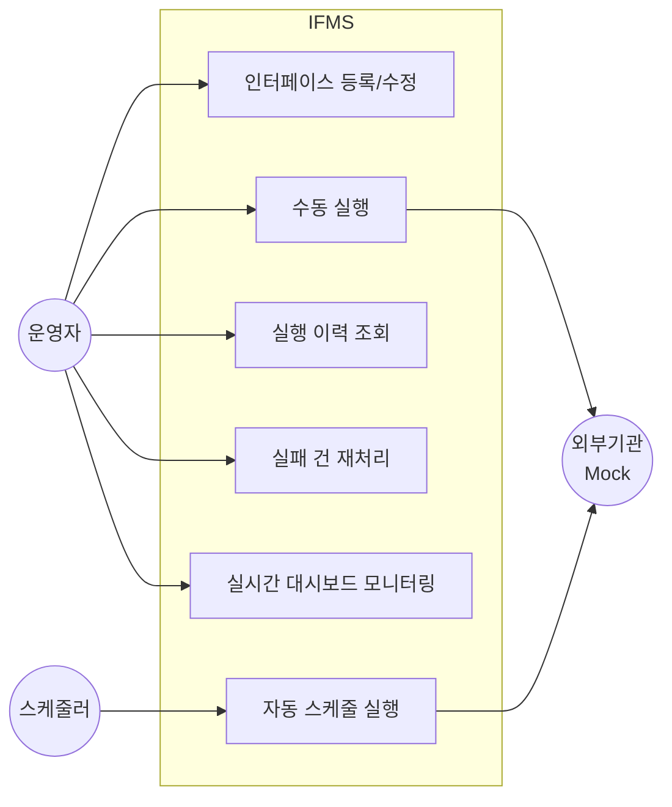
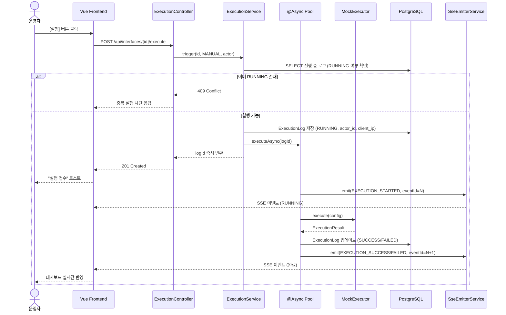
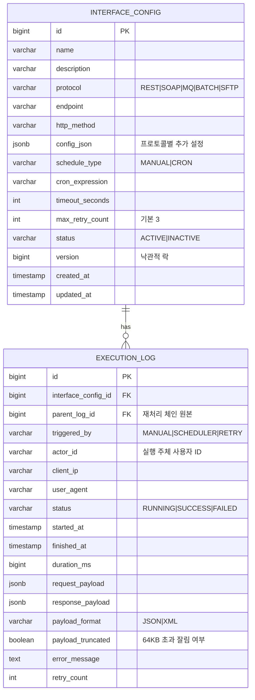

# 보험사 금융 IT 인터페이스 통합관리시스템 기획서

> **Interface Management System (IFMS)**
> 2026년 공채 15기 입사 과제 제출용 개인 프로젝트

---

## 1. 개요

### 1.1 프로젝트 정보

| 항목 | 내용 |
|---|---|
| 프로젝트명 | 보험사 금융 IT 인터페이스 통합관리시스템 (IFMS) |
| 제출 목적 | 노아에이티에스 2026년 공채 15기 입사 과제 |
| 개발 기간 | 2026-04-20 ~ 2026-04-26 (1주) |
| 개발 형태 | 개인 프로젝트 (설계부터 구현까지 전 과정) |
| 제출물 | 기획서 / 개발문서 / 동작 가능한 웹앱 프로토타입 |

### 1.2 한 줄 요약

보험사 내부 핵심 시스템과 외부 기관(금감원, 제휴사 등) 사이에 존재하는 **다수의 이기종 인터페이스**(REST·SOAP·MQ·배치·SFTP)를 **단일 화면에서 등록·실행·모니터링·재처리**할 수 있도록 통합한 중앙 관리 플랫폼 프로토타입.

---

## 2. 배경 및 문제 정의

### 2.1 보험사 IT 인터페이스 현황

보험사 내부에는 하루에도 수십 ~ 수백 건의 외부 연동 작업이 존재한다.
금융감독원 정기 보고, 보험개발원 통계 전송, 제휴 병원·대리점 데이터 수·발신, 재보험사 정산 파일 송수신 등 **성격이 모두 다른 인터페이스**가 **서로 다른 프로토콜**과 **서로 다른 운영 도구**로 관리되고 있다.

현업은 이를 아래와 같은 방식으로 운영한다.

- **REST/SOAP 연동**: 업무시스템별 개별 로그 테이블 조회
- **배치 작업**: 스케줄러(Control-M, Jenkins 등) 개별 콘솔 접속
- **파일 송수신(SFTP)**: 운영 서버 SSH 접속 후 로그 직접 확인
- **MQ 메시지**: 관리 콘솔 또는 DBA에게 조회 요청

즉, "오늘 몇 건 돌았고 몇 건 실패했나"라는 단순한 질문에도 **최소 3~4개 도구를 경유**해야 답을 얻을 수 있다.

### 2.2 대표 시나리오 — 운영팀 김과장의 하루

> **페르소나**
> - 이름: 김현준 과장
> - 소속: ○○생명보험 IT운영팀
> - 경력: 9년차, 외부 연동 운영·장애 대응 담당
> - 주 업무: 일일 인터페이스 정상 실행 확인, 실패 건 재처리, 장애 보고

**09:00** 출근. 어제 야간 배치 결과를 확인하려고 업무시스템 A의 배치 로그 화면을 연다. 성공 23건, 실패 2건. 실패 건의 원인 파악을 위해 서버 ssh 접속해 배치 로그 파일을 grep 한다.

**10:30** 금감원 정기보고 REST API 호출이 타임아웃으로 실패했다는 제보를 받는다. 해당 인터페이스는 업무시스템 B의 별도 테이블에 기록되어 있다. DBA에게 조회 쿼리를 요청하고, 실패 payload를 복원해 **수동으로 curl 재호출**한다.

**13:00** 제휴 병원 MQ 연동 지연 건. MQ 관리 콘솔에 접속해 큐 상태를 확인한다. 메시지가 쌓여 있는 것은 알겠는데, **원본 요청자·시각·재처리 이력**은 콘솔에서 바로 보이지 않는다. 개발팀에 요청해 애플리케이션 로그에서 추적한다.

**17:00** 팀장에게 오늘 인터페이스 실행 현황 보고. "성공률, 실패 건수, 평균 소요 시간"을 취합하는 데 **엑셀 수작업 30분**이 걸린다.

**결론**: 김과장은 하루 중 **실제 문제 해결이 아닌 "현황 파악과 도구 전환"에 40% 이상의 시간**을 쓰고 있다.

### 2.3 주요 Pain Point

| # | 시나리오 | 현재 조치 | 문제 |
|---|---|---|---|
| 1 | 금감원 REST 인터페이스 야간 실패 | 당직자가 서버 SSH → 로그 grep → 수동 재호출 | 재처리 이력이 코드에 남지 않아 감사 추적 불가 |
| 2 | 제휴사 SFTP 파일 누락 | 운영자가 SFTP 로그 + 배치 로그 교차 확인 | 어느 시스템 문제인지 단일 화면에서 판단 불가 |
| 3 | MQ 메시지 지연 | DBA에게 조회 요청 후 결과 대기 | 비개발자는 실시간 상태를 조회할 수단이 없음 |
| 4 | 일일 보고서 취합 | 각 시스템 로그를 엑셀로 복사·합산 | 매일 30분 반복 수작업, 오류 가능성 |

### 2.4 As-Is / To-Be 비교

| 구분 | As-Is (현재) | To-Be (IFMS 도입 후) |
|---|---|---|
| 인터페이스 조회 | 시스템별 개별 도구 3~5개 | **단일 웹 화면** |
| 실행 상태 확인 | 로그 조회 / DBA 요청 | **SSE 기반 실시간 대시보드** |
| 실패 건 재처리 | 수동 curl / 파일 재업로드 | **재처리 버튼 1클릭** + 원본 요청 추적 |
| 감사 로그 | 시스템마다 상이 | **ExecutionLog 통합 저장** (누가/언제/무엇을) |
| 신규 인터페이스 등록 | 시스템마다 담당자 상이 | **표준화된 등록 화면** |
| 일일 보고 | 엑셀 수작업 | **대시보드 자동 집계** |

---

## 3. 요구사항

### 3.1 기능 요구사항

| 분류 | # | 요구사항 | 우선순위 |
|---|---|---|---|
| 인터페이스 관리 | F-01 | 인터페이스 등록/수정/비활성화 | 필수 |
| | F-02 | 프로토콜·엔드포인트·스케줄 설정 | 필수 |
| | F-03 | 상태 필터·검색 목록 조회 | 필수 |
| 실행 | F-04 | 수동 실행 트리거 | 필수 |
| | F-04-1 | **동일 인터페이스 동시 실행 차단** (`RUNNING` 상태 존재 시 재트리거 거부) | 필수 |
| | F-05 | 프로토콜별 Mock 실행 (REST/SOAP/MQ/BATCH/SFTP) | 필수 |
| | F-06 | 비동기 실행 (`@Async`) | 필수 |
| | F-07 | Cron 스케줄 자동 실행 | 선택 |
| 이력 | F-08 | 실행 이력 페이지네이션 조회 | 필수 |
| | F-09 | 상태(성공/실패/진행)별 필터 | 필수 |
| | F-10 | 요청·응답 payload 원문 조회 | 필수 |
| 재처리 | F-11 | 실패 건 재처리 버튼 | 필수 |
| | F-12 | 재처리 체인 추적 (`retry_count` + `parent_log_id`) | 필수 |
| | F-13 | 재처리 최대 횟수 제한 (기본값 3회) | 필수 |
| 모니터링 | F-14 | SSE 기반 실시간 실행 스트림 | 필수 |
| | F-15 | 대시보드 (프로토콜별 현황, 최근 실패) | 필수 |
| | F-16 | 연결 상태 UI 표시 | 필수 |
| 문서 | F-17 | Swagger UI 제공 | 필수 |

### 3.2 비기능 요구사항

| 분류 | 요구사항 | 목표 | 근거 |
|---|---|---|---|
| 성능 | 이력 목록 조회 응답 | p95 < 500ms | 인터페이스 100개 × 10회/일 × 30일 ≈ 3만 건, UI 체감 지연 한계 |
| | 실행 트리거 응답 | < 200ms | 실제 실행은 비동기, 트리거는 DB 1회 INSERT만 |
| 감사 | 모든 실행 건 `ExecutionLog` 저장 | 누락 0건 | 전자금융감독규정 제37조 |
| | 실행 주체 추적 (`actor_id`·`client_ip`·`user_agent`) | 필수 | 〃 |
| | 재처리 체인 추적 (`parent_log_id`) | 필수 | 원본 요청 역추적 요구 |
| 용량 | `request_payload` / `response_payload` 최대 크기 | 64KB, 초과 시 truncate + `payload_truncated` 플래그 | 대용량 응답 저장 시 DB 팽창 방지 |
| 보안 | SQL Injection 방어 (JPA Parameterized Query) | 필수 | OWASP A03 |
| | 민감정보(시크릿) 환경변수 관리 | `.env` + `.gitignore`, 평문 커밋 금지 | KISA G-03 |
| | payload 민감정보 패턴 마스킹 (계좌/주민번호 등) | 저장 시점 마스킹 | 개인정보보호법 제29조 |
| | SSE 엔드포인트 인증 적용 | 필수 | OWASP A01 |
| 운영 | SSE 연결 리소스 자동 정리 | 연결 끊김 즉시 | 리소스 누수 방지 |
| | SSE 이벤트 유실 복구 | `Last-Event-ID` 지원 | 재연결 시 상태 일관성 |
| | 예외 발생 시 상태 일관성 (FAILED 기록) | 필수 | 감사 추적 무결성 |

### 3.3 구현 제외 범위

1주일 일정의 현실성을 확보하기 위해 아래 영역은 **설계만 문서화**하고 구현은 제외한다.

- **실제 외부 연동**: 모든 프로토콜은 Mock 시뮬레이터로 대체
- **사용자 권한 관리**: 단일 인증만 적용, Role 분리는 설계만
- **외부 알림 발송**: Slack/Email 연동은 설계만
- **실시간 클러스터링**: SSE는 단일 인스턴스 기준
- **감사 로그 위변조 방지**: 해시/서명은 설계만

---

## 4. 시스템 개요

### 4.1 유스케이스 다이어그램



### 4.2 주요 액터

| 액터 | 설명 |
|---|---|
| 운영자 | 김과장 페르소나. 인터페이스 등록·수동 실행·이력 조회·재처리 수행 |
| 스케줄러 | 내부 Cron. 예약된 인터페이스를 자동 실행 (선택 기능) |
| 외부기관 (Mock) | 금감원·제휴사·재보험사. 실제 연동 대신 Mock 실행기가 응답 시뮬레이션 |

### 4.3 핵심 기능 목록

```
┌─────────────────────────────────────────────┐
│  IFMS 핵심 기능                               │
├─────────────────────────────────────────────┤
│  ① 인터페이스 CRUD                            │
│  ② 수동/자동 실행 트리거                       │
│  ③ Mock 프로토콜 실행 (REST/SOAP/MQ/BATCH/SFTP)│
│  ④ 실행 이력 통합 관리                         │
│  ⑤ 실패 건 재처리                             │
│  ⑥ SSE 기반 실시간 모니터링                    │
│  ⑦ 대시보드 집계                              │
└─────────────────────────────────────────────┘
```

---

## 5. 아키텍처 설계

### 5.1 전체 구성도

```mermaid
graph TB
    subgraph Browser[브라우저]
        vue[Vue 3<br/>Vuetify 3]
        pinia[Pinia Store]
        es[EventSource]
    end

    subgraph Backend[Spring Boot 3]
        ctrl[Controller 계층]
        svc[Service 계층<br/>@Transactional]
        async[@Async 실행 풀]
        sse[SseEmitterService]
        repo[JPA Repository]
        mock[MockExecutor<br/>Factory]
    end

    subgraph DB[PostgreSQL]
        t1[(interface_config)]
        t2[(execution_log)]
    end

    subgraph Mock[Mock 외부기관]
        rest[REST]
        soap[SOAP]
        mq[MQ]
        batch[BATCH]
        sftp[SFTP]
    end

    vue -->|Axios| ctrl
    es -->|text/event-stream| sse
    ctrl --> svc
    svc --> repo
    svc --> async
    async --> mock
    mock -.시뮬레이션.-> Mock
    async --> sse
    sse -.emit.-> es
    repo --> t1
    repo --> t2
```

### 5.2 모노레포 구조

```
root/
├── CLAUDE.md               # 프로젝트 가이드라인
├── docker-compose.yml      # PostgreSQL 로컬 실행
├── docs/                   # 기획서 / ERD / API 명세 / ADR
│   ├── planning.md
│   ├── erd.md
│   ├── api-spec.md
│   └── adr/
├── .claude/                # Claude Code 에이전트·스킬
│   ├── agents/
│   └── skills/
├── backend/                # Spring Boot 3
│   └── src/main/java/com/noaats/ifms/
│       ├── domain/
│       │   ├── interface_/
│       │   ├── execution/
│       │   └── monitor/
│       └── global/
└── frontend/               # Vue 3
    └── src/
        ├── api/
        ├── components/
        ├── pages/
        ├── stores/
        └── router/
```

**선택 근거**
- 프론트/백엔드 동시 개발 환경이라 **모노레포**로 관리 편의성 확보
- 배포 단위는 분리하되 `docs/`와 기획 자료는 공통 루트에서 관리

### 5.3 레이어 구조

```
┌──────────────────────────────────────────────┐
│ Controller   (REST 엔드포인트, DTO 변환)        │
├──────────────────────────────────────────────┤
│ Service      (@Transactional, 비즈니스 로직)    │
├──────────────────────────────────────────────┤
│ Repository   (JPA, 쿼리 메서드)                │
├──────────────────────────────────────────────┤
│ Domain       (Entity, 비즈니스 메서드)          │
└──────────────────────────────────────────────┘
```

**원칙**
- `@Transactional`은 **Service 계층에서만** 선언 (Controller 금지)
- Entity는 `@Setter` 금지, 상태 변경은 비즈니스 메서드로만
- DTO는 `{도메인}Request` / `{도메인}Response` 분리

### 5.4 실시간 모니터링: SSE 채택 근거

WebSocket과 SSE를 두고 아래 관점에서 비교했다.

| 관점 | WebSocket | **SSE (채택)** |
|---|---|---|
| 통신 방향 | 양방향 | 서버 → 클라이언트 단방향 |
| 프로토콜 | 자체 프로토콜 | HTTP/1.1 표준 |
| 브라우저 지원 | 표준 | 표준 |
| 자동 재연결 | 수동 구현 | **내장** |
| 방화벽/프록시 호환 | 추가 설정 필요 | HTTP 그대로 |
| 구현 복잡도 | 높음 | **낮음** |
| 본 프로젝트 요구사항 | 과함 | **적합** |

**결정**: 본 시스템의 실시간 기능은 "서버가 실행 상태를 일방향 푸시"하는 구조로 충분하므로 **SSE 채택**. 상세 근거는 부록 A의 ADR-002 참조.

**이벤트 유실 복구 전략**
- 브라우저 `EventSource`는 연결 끊김 시 자동 재연결하되, 그 사이 서버가 emit한 이벤트는 기본적으로 유실된다.
- 서버는 각 SSE 이벤트에 단조 증가 `id`를 부여하고, 재연결 시 브라우저가 자동 전송하는 `Last-Event-ID` 헤더를 읽어 **최근 N건(기본 100건)을 메모리 링버퍼에서 재전송**한다.
- 추가 안전망으로 프런트는 SSE 재연결 직후 `GET /api/executions?since={timestamp}`를 폴백 호출해 누락분을 보강한다.

### 5.5 비동기 실행 흐름



**@Async 스레드풀 파라미터** (상세는 `.claude/skills/mock-executor.md` AsyncConfig)

- `corePoolSize = 4`, `maxPoolSize = 8`, `queueCapacity = 50`
- 거부 정책: `CallerRunsPolicy` (큐 포화 시 호출 스레드가 직접 실행해 요청 유실 방지)
- 스레드명 접두사: `mock-exec-`

**동시 실행 차단 구현 방식** (ADR-004 확정 예정)

- 1차: `ExecutionLog` 조회 시 `(interface_config_id, status=RUNNING)` 유니크 검증
- 2차: PostgreSQL advisory lock (`pg_try_advisory_xact_lock(interface_config_id)`)으로 레이스 컨디션 제거
- Cron 스케줄러 자동 실행도 동일 경로 사용

---

## 6. 기술 스택 및 선정 근거

### 6.1 Backend

| 계층 | 기술 | 버전 |
|---|---|---|
| Language | Java | 17 (LTS) |
| Framework | Spring Boot | 3.x |
| ORM | Spring Data JPA + Hibernate | 6.x |
| Security | Spring Security | 6.x (최소 인증) |
| DB (운영) | PostgreSQL | 16 |
| DB (테스트) | H2 | 2.x (in-memory) |
| 실시간 | SseEmitter | Spring 내장 |
| Build | Gradle | 8.x |
| Doc | SpringDoc OpenAPI | 2.x (Swagger UI) |
| 생산성 | Lombok, MapStruct | 최신 |

### 6.2 Frontend

| 계층 | 기술 | 버전 |
|---|---|---|
| Framework | Vue | 3.x (Composition API) |
| Build | Vite | 5.x |
| State | Pinia | 2.x |
| Router | Vue Router | 4.x |
| HTTP | Axios | 1.x |
| UI | Vuetify | 3.x |

### 6.3 기술 선택 트레이드오프

| 결정 | 채택 | 기각 대안 | 근거 |
|---|---|---|---|
| 백엔드 언어 | Java 17 | Kotlin, Node.js, Java 21 | 노아에이티에스 주력 스택 (JSP → Spring Boot 전환 중). 17 LTS 채택 사유: Virtual Thread 등 21 전용 기능 불요, 현 개발 환경 JDK 17 기본 |
| 프런트 프레임워크 | Vue 3 | React, Svelte | 노아 채용 공고 명시 스택 |
| UI 라이브러리 | Vuetify 3 | Element Plus, Naive UI | 풍부한 기본 컴포넌트 + 모던 디자인 |
| 실시간 통신 | SSE | WebSocket, Polling | 서버 → 클라이언트 단방향 충분, HTTP 표준 |
| DB | PostgreSQL | MySQL, Oracle | 금융권 채택 증가, JSONB 지원 (payload 저장) |
| 비동기 | @Async + ThreadPool | 메시지 큐(RabbitMQ) | 프로토타입 범위 과함 |

---

## 7. 데이터 모델 개요

### 7.1 핵심 엔티티



**주요 설계 결정 (기획서 확정 사항)**

- `request/response_payload`: **JSONB** (집계·부분 검색 가능, GIN 인덱스). SOAP XML은 `payload_format=XML`로 구분해 문자열 그대로 저장
- `parent_log_id`: 재처리 원본 역추적. 원본은 `NULL`
- `actor_id` / `client_ip` / `user_agent`: 전자금융감독규정 제37조 감사 요건
- `payload_truncated`: 64KB 초과 응답을 잘라 저장했는지 표시
- `max_retry_count`: 기본 3회, 초과 시 재처리 버튼 비활성화
- `version`: `@Version` 기반 낙관적 락 (동시 수정 방지)

### 7.2 상세

테이블 정의 · 인덱스 전략 · 제약조건 상세는 [docs/erd.md](erd.md) 참조.

---

## 8. 화면 구성

### 8.1 사이트맵

```
IFMS
├── / (대시보드)
├── /interfaces (목록)
│   ├── /interfaces/new (등록)
│   └── /interfaces/:id/edit (수정)
├── /executions (실행 이력)
│   └── /executions/:id (상세)
└── /swagger-ui.html (API 문서)
```

### 8.2 주요 화면 목록

| 화면 | 경로 | 핵심 기능 |
|---|---|---|
| 대시보드 | `/` | 프로토콜별 현황, 실시간 실행 피드, 최근 실패 목록 |
| 인터페이스 목록 | `/interfaces` | 검색/필터, 상태 Chip, 실행 버튼 |
| 인터페이스 등록 | `/interfaces/new` | 프로토콜별 동적 입력 필드, 폼 검증 |
| 인터페이스 수정 | `/interfaces/:id/edit` | 비활성화 토글 포함 |
| 실행 이력 | `/executions` | 상태/기간/인터페이스 필터, 페이지네이션 |
| 실행 상세 | `/executions/:id` | 요청·응답 payload 원문, 재처리 버튼 |
| API 문서 | `/swagger-ui.html` | Swagger UI |

### 8.3 화면별 기능 상세

**대시보드 (/)**
- 요약 카드 4종: 오늘 성공 / 실패 / 실행 중 / 전체 인터페이스 수
- 프로토콜별 도넛 차트
- 실시간 실행 피드 (SSE, 최근 20건)
- 최근 실패 목록 (재처리 바로가기)
- 연결 상태 chip (LIVE / 연결 중)

**인터페이스 목록 (/interfaces)**
- 서버사이드 페이지네이션 (`v-data-table-server`)
- 프로토콜 Chip (색상 코딩: REST/SOAP/MQ/BATCH/SFTP)
- 상태 토글 (ACTIVE/INACTIVE)
- 행별 [실행] [수정] [상세] 아이콘 버튼
- 상단 [등록] 버튼 → 다이얼로그

**실행 이력 (/executions)**
- 필터: 상태 / 프로토콜 / 인터페이스명 / 기간
- 소요시간 / 재시도 횟수 컬럼
- 실패 건 하이라이트
- 행 클릭 시 상세 드로어

---

## 9. API 설계 개요

### 9.1 원칙

- **RESTful**: 리소스 중심 URL (`/api/interfaces`, `/api/executions`)
- **HTTP 메서드 명확화**: GET(조회) / POST(생성) / PATCH(부분수정) / DELETE(삭제)
- **응답 래핑**: 모든 응답은 `ApiResponse<T>` 구조
  ```json
  {
    "success": true,
    "data": {...},
    "message": null,
    "timestamp": "2026-04-20T10:00:00"
  }
  ```
- **상태 코드 명확화**: 200 / 201 / 400 / 404 / 500
- **페이지네이션**: Spring `Pageable` (오프셋 기반)
- **에러 포맷 통일**: `GlobalExceptionHandler`

### 9.2 주요 엔드포인트

| 카테고리 | 메서드 | 경로 | 설명 |
|---|---|---|---|
| 인터페이스 | GET | `/api/interfaces` | 목록 조회 (페이지네이션) |
| | GET | `/api/interfaces/{id}` | 단건 조회 |
| | POST | `/api/interfaces` | 등록 |
| | PATCH | `/api/interfaces/{id}` | 수정 |
| | POST | `/api/interfaces/{id}/execute` | 수동 실행 트리거 |
| 실행 이력 | GET | `/api/executions` | 이력 조회 (필터·페이지네이션). `?since={timestamp}` 파라미터 지원 — SSE 링버퍼 밀림 시 누락 이벤트 폴백 조회용 |
| | GET | `/api/executions/{id}` | 실행 상세 |
| | POST | `/api/executions/{id}/retry` | 재처리 |
| 모니터링 | GET | `/api/monitor/stream` | SSE 스트림 (`text/event-stream`) |
| | GET | `/api/monitor/dashboard` | 대시보드 집계 |

### 9.3 상세

요청/응답 DTO 구조 · 예시 payload · 에러 케이스는 [docs/api-spec.md](api-spec.md) 참조.

---

## 10. Mock 실행 전략

### 10.1 채택 사유

실제 외부 기관과의 연동은 아래 리스크가 있어 Mock으로 대체한다.

- **네트워크 리스크**: 외부 시스템 부재 시 타임아웃 대기
- **보안 리스크**: 과제 제출 환경에서 실제 크리덴셜 노출 불가
- **일정 리스크**: 프로토콜별 실제 연동은 1주 범위 초과

Mock은 **실제와 유사한 지연 시간·성공률·응답 포맷**을 재현하여, 실연동 전환 시 `MockExecutor` 구현체만 교체하면 되도록 설계했다.

### 10.2 프로토콜별 시뮬레이션 규칙

| 프로토콜 | 지연 시간 | 실패율 | 응답 포맷 |
|---|---|---|---|
| REST | 200 ~ 800ms | 15% | JSON `{status, message}` |
| SOAP | 300 ~ 700ms | 5% | SOAP XML Envelope |
| MQ | 100 ~ 300ms | 5% | JSON `{queue, messagesPublished}` |
| BATCH | 1 ~ 3초 | 10% (98% 내부 성공률) | JSON `{totalCount, successCount, failCount}` |
| SFTP | 500ms ~ 1.5초 | 10% | JSON `{host, bytesTransferred}` |

**실패율 근거**: 실제 금융 연동 통계(금감원 보고 타임아웃, MQ 지연 장애)를 단순화한 수치. 시연 중 "전부 실패"를 막기 위해 각 프로토콜 실패율은 독립 분포로 적용하고, 대시보드에 "실패율 강제 0" 토글(운영/시연 모드)을 선택 기능으로 남긴다.

**교체 전략**
- 인터페이스 `MockExecutor`는 운영용 `RealExecutor`와 동일 시그니처
- `MockExecutorFactory`를 `ExecutorFactory`로 승격해 `@Profile` 분기
- 실행 서비스(`ExecutionService`)는 변경 없음

---

## 11. 개발 일정

| Day | 날짜 | 주요 작업 | 산출물 |
|---|---|---|---|
| 1 ✅ | 04-20 | 기획서 / ERD / API 명세 / 프로젝트 초기화 | `docs/planning.md` v0.3, `docs/erd.md` v0.9, `docs/api-spec.md` v0.6, `docker-compose.yml` |
| 2 ✅ | 04-20 | ADR-001/004/006 회의 · 백엔드 도메인 모델 · JPA · CRUD API · 2-A global 16파일 + 2-B domain 13파일 | ADR 3건, `InterfaceConfig` 도메인 세트, 전역 예외·마스킹·검증 인프라 |
| 3 | 04-22 | ADR-005 회의 · 실행 트리거 · Mock 실행기 · 이력 저장 · 중복 방지 구현 | ADR 1건, `ExecutionService`, `MockExecutor*` |
| 4 | 04-23 | 재처리 · SSE(`Last-Event-ID` 포함) · 대시보드 집계 · Vuetify 스파이크 | `SseEmitterService`, `MonitorController` |
| 5 | 04-24 | 프런트 인터페이스 목록 · 등록 다이얼로그 | `InterfaceList.vue`, `InterfaceFormDialog.vue` |
| 6 | 04-25 | 실행 이력 · 재처리 · 대시보드 · SSE 연동 | `Dashboard.vue`, `ExecutionHistory.vue` |
| 7 | 04-26 | 통합 테스트 · 버그 수정 · 개발문서 정리 · 제출 | 최종 제출물 |

---

## 12. 향후 확장 방향

### 12.1 실제 연동 전환

| 영역 | 변경 범위 | 영향 크기 |
|---|---|---|
| `MockExecutor` → `RealExecutor` | 프로토콜별 구현체 추가 | 중 |
| 시크릿 관리 | Vault 또는 AWS Secrets Manager 연동 | 소 |
| 타임아웃·리트라이 | `RestTemplate`/`WebClient` 설정 | 소 |
| 서킷 브레이커 | Resilience4j 도입 | 중 |

설계는 `MockExecutor` 인터페이스 계약을 유지하므로 **서비스·컨트롤러 변경 없음**.

### 12.2 운영 고도화

- **권한 관리**: Spring Security + JWT + Role (OPERATOR / ADMIN / AUDITOR)
- **알림 발송**: 실패 건 Slack / Email 웹훅 연동
- **감사 로그 무결성**: `ExecutionLog` 해시 체인 또는 서명
- **분산 SSE**: Redis Pub/Sub 기반 멀티 인스턴스 브로드캐스트
- **이력 파티셔닝**: `execution_log` 월 단위 범위 파티션
- **관측성**: Prometheus 메트릭 + Grafana 대시보드

---

## 13. 부록

### A. 기술 의사결정 기록 (ADR)

핵심 설계 결정은 [docs/adr/](adr/) 하위에 개별 문서로 기록한다. 초기 6건 후보 중 **본 기획서 본문(또는 ERD)에서 확정된 사안은 본문으로 편입**하고, 설계 논의가 남은 2건만 정식 ADR로 기록한다. Day 2 회의 오버헤드를 최소화하기 위해 ADR-002 SSE 이벤트 유실 복구(§5.4)도 본문 편입.

| 번호 | 안건 | 소집 시점 |
|---|---|---|
| ADR-001 | ExecutionLog 트랜잭션 범위 | Day 2 |
| ADR-004 | 동시 실행 중복 방지 전략 (advisory lock + 상태 체크 2중 방어) | Day 2 |
| ADR-005 | 재처리 최대 횟수·체인 분기 금지 정책 | Day 3 |

**기획서 본문 편입 결정**

- payload 저장: **JSONB** (§6.3 기술 스택 근거 · §7.1 ERD에 확정)
- API 인증: 프로토타입 범위에서 **세션 기반 최소 인증 + SSE 엔드포인트 Spring Security 필터 적용** (§3.2 비기능 요구사항에 명시)
- SSE 브로드캐스트 + 이벤트 유실 복구: `Last-Event-ID` 기반 링버퍼 100건 + `GET /api/executions?since=` 폴백 (§5.4에 확정)

각 ADR은 4명 에이전트 회의(@Architect / @Security / @DBA / @DevilsAdvocate) 결과를 기록한다. 상세 프로토콜은 [.claude/agents/MEETING-PROTOCOL.md](../.claude/agents/MEETING-PROTOCOL.md).

### B. 용어 정의

| 용어 | 정의 |
|---|---|
| 인터페이스 | 본 시스템이 관리하는 외부 연동 단위. `InterfaceConfig` 엔티티로 표현 |
| 실행 | 인터페이스를 1회 호출하는 행위. 수동/자동/재처리로 구분 |
| ExecutionLog | 실행 1건의 이력 레코드. 감사 추적의 근거 |
| Mock 실행기 | 실제 외부 연동을 대체하는 시뮬레이터 |
| SSE | Server-Sent Events. 서버 → 브라우저 단방향 실시간 푸시 프로토콜 |
| ADR | Architecture Decision Record. 설계 결정의 맥락과 근거를 남기는 문서 |

---

**문서 버전**

- v0.1 — 2026-04-20, 초안 작성
- v0.2 — 2026-04-20, 4-에이전트 검토 반영
  - 3.1: F-04-1 동시 실행 차단, F-13 재처리 최대치 필수화
  - 3.2: 성능 목표 근거, 감사 필드(`actor_id`/`client_ip`/`user_agent`/`parent_log_id`) 명시, payload 64KB 제한, payload 마스킹, SSE 인증, `Last-Event-ID` 복구
  - 5.4: SSE 이벤트 유실 복구 전략 추가
  - 5.5: 시퀀스에 중복 실행 차단 분기 추가, @Async 스레드풀 파라미터·advisory lock 명시
  - 7.1: ERD에 `parent_log_id`/`actor_id`/`client_ip`/`user_agent`/`payload_truncated`/`config_json`/`version`/`max_retry_count` 추가, payload TEXT→JSONB
  - 10.2: 시뮬레이션 실패율 독립 분포로 조정, 시연 모드 토글 추가
  - 11: Day 2/3 ADR 회의 포함
  - 13.A: ADR 6건 → 4건 축소, 본문 편입 결정 명시
- v0.4 — 2026-04-20, Day 2 완료 반영 (Day 1·2 ✅ 마킹), Java 21 → Java 17 정정 (환경 호환), ADR 6건 → 확정 3건(ADR-001/004/006)로 갱신
- v0.3 — 2026-04-20, 2차 4-에이전트 재검토 반영 (DevilsAdvocate 조건부 B)
  - §9.2: `GET /api/executions?since={timestamp}` SSE 폴백 엔드포인트 명시
  - §13.A: ADR-002(SSE)를 본문 편입으로 전환, 정식 ADR 4건 → 3건 축소
  - §11: Day 2 ADR 회의 3건 → 2건 (ADR-001/004)
